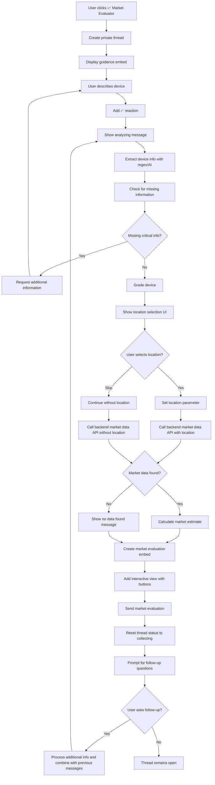

# Market Evaluator Discord Bot Flow

## Overview

The Market Evaluator feature is a Discord bot functionality that provides users with accurate market value estimates for their devices through a guided thread-based interaction. The bot uses AI for device analysis and integrates with backend market data APIs to provide current pricing estimates based on real marketplace data from eBay and other platforms.

## Backend Integration

The bot integrates with the backend market data API for real-time pricing information:

- **Backend API URL**: Environment variable `BACKEND_URL`
- **Endpoint**: `/api/market-data/`
- **Purpose**: Retrieves current market pricing data from eBay and marketplace listings
- **Data Source**: Real-time scraping and analysis of marketplace listings
- **Parameters**: Device model, storage capacity, condition grade (optional), and location (optional)

## Permission Requirements

- Available to all users (no premium access required)
- No specific role restrictions for market evaluator functionality

## Flow Description

### 1. Initial Trigger

- User visits the **📈│ᴍᴀʀᴋᴇᴛ-ᴇᴠᴀʟᴜᴀᴛᴏʀ** channel (ID: 1366406029121687645)
- Bot displays a welcome message with action buttons including "📈 Market Evaluator"

### 2. Thread Creation

- Bot creates a private thread named `{username}'s Market Evaluation`
- Thread auto-archives after 60 minutes of inactivity
- Bot responds with ephemeral message containing clickable link to the thread

### 3. Guidance Display

- Bot posts welcome message in the thread mentioning the user
- Displays guidance embed with blue color containing:
  - **Title**: "Market Evaluator Guidance"
  - **Description**: Instructions for providing device information
  - **Footer**: "Type your details in this thread. I'll process your message automatically."

### 4. Device Information Collection

- User types their device description including model, storage, condition, and any known issues
- Bot validates:
  - Message is from thread owner (original user)
  - Thread is in "collecting" status
- Bot adds ✅ reaction to acknowledge message receipt
- Bot stores message in thread tracking data

### 5. Location Selection Process

#### 5.1 Location Selection Display
- After collecting device information, bot displays location selection UI
- **Location Selection Title**: "📍 Select Your Location"
- **Description**: "Please select your location to get more accurate market data. This helps us filter marketplace ads relevant to your area."
- **Options**: Adelaide, Brisbane, Gold Coast, Melbourne, Newcastle, Perth, Sunshine Coast, Sydney, Darwin, Other
- **Skip Option**: User can skip location selection if preferred

#### 5.2 Location Processing
- If location selected: Filter marketplace ads based on selected region
- If "Other" or skipped: Use national marketplace data without location filtering
- Location data sent to backend API for region-specific market analysis

### 6. Market Analysis Process

#### 6.1 Processing Initiation
- **First message**: "Analyzing market data for your device..."
- **Follow-up messages**: "Collecting additional device information..."
- Bot combines all user messages into comprehensive device description

#### 6.2 Device Information Extraction
- Uses regex-based parsing to extract structured device information:
  - **Model identification**: iPhone patterns (iPhone 12, iPhone 13 Pro Max, etc.)
  - **Storage capacity**: GB/TB patterns (128GB, 256GB, 512GB, 1TB)
  - **Battery percentage**: If mentioned in description
  - **Explicit grade**: A+, A, B, C, D grades if provided by user
  - **Raw description**: Original user input for AI analysis

#### 6.3 Input Normalization
- Normalizes various input formats:
  - `iphone13promax` → `iPhone 13 Pro Max`
  - `256g` → `256GB`
  - `1t` → `1TB`
- Handles spaced storage units and abbreviations

#### 6.4 Device Grading Assessment
- **Explicit Grade Priority**: Uses user-provided grades (A+, A, B, C, D) if available
- **AI Grading Fallback**: Uses GradingService with combined grading method for automatic assessment
- **Grade Meanings**:
  - **A+**: Perfect Condition
  - **A**: Excellent Condition
  - **B**: Good Condition
  - **C**: Fair Condition
  - **D**: Poor Condition

#### 6.5 Market Data Retrieval
- **API Integration**: Calls backend `/api/market-data/` endpoint
- **Parameters**: Model, storage, grade (if available), and location (if provided)
- **Location Filtering**: If location provided, filters marketplace ads for relevant region
- **Data Sources**: eBay and marketplace listing statistics
- **Search Strategy**: Searches with grade if provided, otherwise searches across all grades
- **Error Handling**: Graceful fallback for API connectivity issues

#### 6.6 Market Value Calculation
- **Price Analysis**: Extracts price data from backend statistics
- **Median Calculation**: Calculates median prices from eBay and marketplace data
- **Final Estimate Methods**:
  1. **Both Sources Available**: Average of eBay and marketplace medians
  2. **Single Source**: Uses available median with ±10% range
  3. **No Data**: Returns appropriate error message
- **Range Estimation**: Provides price range based on data availability

### 7. Response Delivery

#### 7.1 Initial Response
- Displays: "**Market evaluation based on:** {user_device_description} (Location: {location})" if location provided
- Otherwise: "**Market evaluation based on:** {user_device_description}"

#### 7.2 Main Market Evaluation Embed (Color varies by data availability)
**Device Information Section:**
- Model, storage capacity
- Assessed condition grade (explicit or AI-determined)
- Battery percentage (if provided)
- Location (if provided and not "Other")

**Market Value Estimation:**
- **💵 Estimated Market Value**: Best estimate price or price range
- **💵 Estimated Market Value Range**: When no grade provided (shows range across all conditions)

**Special Indicators:**
- **ℹ️ Grade Information**: Shown when no grade provided, explaining range covers all conditions
- **⚠️ Important Note**: Disclaimer about final pricing based on actual inspection

**Error Handling:**
- **❌ Estimation Error**: API or processing errors
- **❌ No Market Data Found**: No comparable listings found

**Footer**: "Market estimates are based on current comparable listings and may vary."

#### 7.3 Interactive Elements
- **🔄 Request Re-evaluation**: Button to request more detailed analysis
- **💡 Get Selling Tips**: Provides personalized selling recommendations based on device condition and market data

### 8. Follow-up Interaction Support

- Thread remains open for additional questions and clarifications
- Users can provide more details to refine market estimates
- Bot encourages follow-up: "💬 Feel free to ask any follow-up questions or provide additional information to refine the evaluation."
- **Improved Follow-up Handling**:
  - Bot automatically detects follow-up messages vs initial messages
  - Follow-up messages trigger refined evaluation with message "Collecting additional device information..."
  - All previous messages are combined for comprehensive analysis
  - Thread status is properly reset to continue accepting messages

### 9. Error Handling

- **Backend API unavailable**: Shows connection error with retry suggestion
- **Device not found**: Provides guidance for providing more details
- **AI grading errors**: Falls back to basic device information structure
- **Market calculation errors**: Shows error message with manual assessment offer
- **Missing information**: Requests additional details with specific examples

## Mermaid Flow Diagram



## Message Templates

### Guidance Content

```
To help accurately predict the market value, please describe your device:

📱 **Device Details:**
• Model and storage (e.g., iPhone 12, 128GB)
• Condition details (scratches, cracks, cosmetic issues)
• Battery health percentage (if known)
• Any functional issues

**Example:** iPhone 12, A grade, 128GB, 86% battery

The more information you provide, the more accurate our market evaluation will be!

**Note:** Final pricing will be based on actual inspection.
```

### Thread Responses

- **Initial processing acknowledgment**: `"Analyzing market data for your device..."`
- **Follow-up processing acknowledgment**: `"Collecting additional device information..."`
- **Thread welcome**: `"{user_mention} Tell us about your phone in the next message.\n\nYou can refer to the guidance below for more details."`
- **Follow-up prompt**: `"💬 Feel free to ask any follow-up questions or provide additional information to refine the evaluation."`
- **Based on message**: `"**Market evaluation based on:** {user_device_description}"`

### Footer Text

- **Market disclaimer**: `"Market estimates are based on current comparable listings and may vary."`

## Example User Inputs and Expected Responses

### Example 1: Complete Information with Grade

**User Input**:
```
iPhone 13 Pro Max 256GB, A grade, 89% battery. Excellent condition,
minimal signs of use. All functions work perfectly.
```

**Bot Response**:
1. ✅ reaction on message
2. "Analyzing market data for your device..."
3. **"Market evaluation based on:** iPhone 13 Pro Max 256GB, A grade...**"
4. **💰 Market Value Estimation: iPhone 13 Pro Max 256GB** (Green embed):
   - **📱 Device Information**:
     ```
     Model: iPhone 13 Pro Max
     Storage: 256GB
     Grade: A (Excellent Condition)
     Battery: 89%
     ```
   - **💵 Estimated Market Value**:
     ```
     $750 - $850
     Best estimate: $800
     ```
   - **⚠️ Important Note**:
     ```
     Final pricing will be based on actual inspection. This estimate
     is based on current market listings and may vary depending on
     actual device condition.
     ```
   - **Footer**: "Market estimates are based on current comparable listings and may vary."
5. Interactive buttons: 🔄 Request Re-evaluation, 💡 Get Selling Tips
6. "💬 Feel free to ask any follow-up questions or provide additional information to refine the evaluation."

### Example 2: Missing Storage Information

**User Input**:
```
iPhone 12 Pro, good condition, 85% battery
```

**Bot Response**:
1. ✅ reaction on message
2. "Analyzing market data for your device..."
3. **📋 Additional Information Needed** (Yellow embed):
   - **❓ Missing Information**:
     ```
     • Storage capacity (e.g., 128GB, 256GB, 512GB)
     ```
   - **💡 Example**:
     ```
     iPhone 12 Pro, 256GB, good condition, 85% battery
     ```
   - **Footer**: "Please provide the missing information and I'll generate your market evaluation."

### Example 3: No Grade Provided

**User Input**:
```
iPhone 14 256GB, some scratches on back, screen is perfect, 82% battery
```

**Bot Response**:
1. ✅ reaction on message
2. "Analyzing market data for your device..."
3. **💰 Market Value Estimation: iPhone 14 256GB** (Blue embed):
   - **📱 Device Information**:
     ```
     Model: iPhone 14
     Storage: 256GB
     Grade: B (Good Condition) [AI assessed]
     Battery: 82%
     ```
   - **ℹ️ Grade Information**:
     ```
     As no grade was provided, we can only provide the price range
     based on market valuations across all condition grades.
     ```
   - **💵 Estimated Market Value Range**:
     ```
     $450 - $650
     Best estimate: $550
     ```

### Example 4: No Market Data Available

**User Input**:
```
Google Pixel 7a 128GB, excellent condition
```

**Bot Response**:
1. ✅ reaction on message
2. "Analyzing market data for your device..."
3. **💰 Market Value Estimation: Google Pixel 7a 128GB** (Red embed):
   - **📱 Device Information**:
     ```
     Model: Google Pixel 7a
     Storage: 128GB
     Grade: A (Excellent Condition) [AI assessed]
     ```
   - **❌ No Market Data Found**:
     ```
     Sorry, I couldn't find any comparable listings for this device.
     Try providing more details or check if the model and storage are correct.
     ```

### Example 5: Follow-up Question

**User Input** (after Example 1):
```
What if the battery was only 70%?
```

**Bot Response**:
1. ✅ reaction on message
2. "Collecting additional device information..."
3. **Updated market evaluation** with adjusted estimates:
   - Lower estimated value due to battery condition
   - Updated selling tips reflecting battery concern

### Example 6: Location Selection Process

**User Input**:
```
iPhone 13 Pro Max 256GB, good condition, 85% battery, minor scratches on back
```

**Bot Response**:
1. ✅ reaction on message
2. "Analyzing market data for your device..."
3. **📍 Select Your Location** (Blue embed with dropdown):
   - **Description**: "Please select your location to get more accurate market data. This helps us filter marketplace ads relevant to your area."
   - **Dropdown options**: Adelaide, Brisbane, Gold Coast, Melbourne, Newcastle, Perth, Sunshine Coast, Sydney, Darwin, Other
   - **Skip button**: "⏭️ Skip Location"
   - **Footer**: "You can skip this step if you prefer not to specify your location."

**User selects "Sydney"**:
4. Ephemeral message: "📍 Location selected: **Sydney**\n\nNow generating your market evaluation with location-filtered data..."
5. **💰 Market Value Estimation: iPhone 13 Pro Max 256GB** (Green embed):
   - **📱 Device Information**:
     ```
     Model: iPhone 13 Pro Max
     Storage: 256GB
     Grade: B (Good Condition) [AI assessed]
     Battery: 85%
     Location: Sydney
     ```
   - **💵 Estimated Market Value**:
     ```
     $850 - $950
     Best estimate: $900
     ```

### Example 7: Backend API Error

**User Input**: Valid device description when backend API is unavailable

**Bot Response**:
1. ✅ reaction on message
2. "Analyzing market data for your device..."
3. Location selection (if not skipped)
4. **❌ Estimation Error**: "Unable to connect to market data service. Please try again later."

## Interactive Features

### Get Selling Tips Button

Provides personalized recommendations based on:
- **Grade-based tips**: Different strategies for A+ vs C grade devices
- **Battery health tips**: Specific advice based on battery percentage
- **General selling tips**: Platform recommendations, photo tips, pricing strategy
- **Suggested listing price**: Based on estimated market range

**Example Tips for A Grade Device**:
```
🎯 Recommendations
• Highlight the excellent condition in your listing
• Take high-quality photos showing the pristine condition
• Consider listing at the higher end of the price range
• Emphasize the excellent 89% battery health
• Include original accessories if you have them
• Clean the device thoroughly before photos

💰 Suggested Listing Price
List between $750 - $850
Start at $850 and be willing to negotiate
```

## Current Limitations

1. **Model Support**: Currently optimized for iPhone models, limited support for other brands
2. **Backend Dependency**: Requires stable connection to backend market data API
3. **Market Data Coverage**: Limited to devices with sufficient marketplace listings
4. **Estimation Accuracy**: Prices are estimates based on listings, not guaranteed selling prices
5. **Grade Subjectivity**: AI grading may not match actual device condition assessment
6. **Regional Coverage**: Location filtering available for major Australian cities; some regional areas may still use national data
7. **Time Sensitivity**: Market prices fluctuate, estimates may become outdated
8. **No Image Analysis**: Cannot analyze uploaded photos for condition assessment
9. **Single Device Focus**: Cannot compare multiple devices in one evaluation
10. **Memory Storage Only**: No persistent storage of evaluations or user preferences
11. **Limited Condition Factors**: Cannot account for warranty status, original accessories, or box condition
12. **API Rate Limits**: May be subject to backend API rate limiting during high usage

## Technical Implementation Details

### Device Information Extraction
- **Regex Patterns**: Specific patterns for iPhone model detection
- **Storage Normalization**: Handles various storage input formats
- **Battery Extraction**: Percentage pattern matching
- **Grade Detection**: A-D grade pattern recognition

### Grading Integration
- **GradingService**: Uses LangChain-based grading with combined method
- **Fallback Strategy**: Explicit user grades take priority over AI assessment
- **Error Handling**: Graceful degradation when grading fails

### Market Data Processing
- **Statistics Processing**: Median calculation from price arrays
- **Multi-source Aggregation**: Combines eBay and marketplace data
- **Range Calculation**: Creates confidence ranges based on data availability
- **Data Quality**: Validates price data before processing

### Thread Management
- **State Tracking**: Maintains thread status and message history
- **Follow-up Support**: Distinguishes between initial and follow-up messages
- **Error Recovery**: Resets thread state for continued interaction