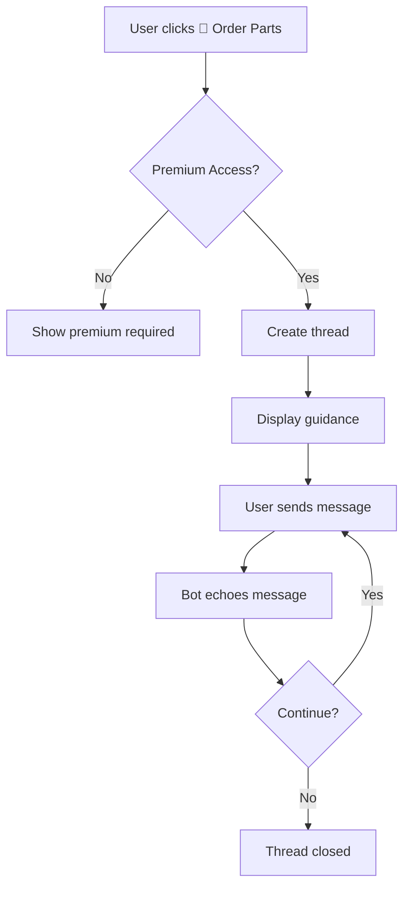

# Order Parts Discord Bot Flow

## Overview

The Order Parts feature is a Discord bot functionality that allows users to request parts for device repairs through a guided thread-based interaction. This is currently implemented as a demo feature that echoes user input rather than processing actual orders.

## Permission Requirements

- Only users with premium access (role ID: 1324737846371815435) can use this feature

## Flow Description

### 1. Initial Trigger

- User visits the **🛠️│ʀᴇᴘᴀɪʀ-ʙᴏᴛ** channel (ID: 1366386159504330752)
- Bot displays a welcome message with action buttons including "🛒 Order Parts"

### 2. Permission Check

- When user clicks "🛒 Order Parts" button, the bot performs permission validation:
  - Checks if user is bot owner (automatic access)
  - If not owner, validates premium role membership
  - If no premium access, displays premium required message and stops

### 3. Thread Creation

- Bot creates a private thread named `{username}'s Order Parts`
- Thread auto-archives after 60 minutes of inactivity
- Bot responds with ephemeral message containing clickable link to the thread

### 4. Guidance Display

- Bot posts welcome message in the thread mentioning the user
- Displays guidance embed with blue color (0x3498db) containing:
  - **Title**: "Order Parts"
  - **Description**: Instructions for providing part details
  - **Footer**: "Type your details in this thread. I'll process your message automatically."

### 5. User Interaction Loop

- User types their parts request message in the thread
- Bot validates:
  - Message is from thread owner (original user)
  - Thread status is "collecting" (not "processing")
- Bot adds ✅ reaction to acknowledge message receipt
- Bot temporarily sets status to "processing" to prevent duplicate handling

### 6. Echo Response (Demo Behavior)

- Bot retrieves the latest message from stored thread data
- Responds with: `"You said: {user_message}"`
- Sends follow-up: `"You can continue sending messages, or close this thread when you're done."`
- Resets thread status back to "collecting" to allow more messages

### 7. Error Handling

- Thread creation errors show: "There was an error creating the thread. Please try again later."
- Message processing errors display generic error response
- Failed reactions are silently ignored

## Technical Implementation Details

### Key Components

1. **OrderPartsHandler** ([order_parts_handler.py:12](utils/thread_handlers/order_parts_handler.py#L12))

   - Inherits from BaseThreadHandler
   - Manages class-level thread tracking dictionary
   - Implements echo-based message handling

2. **BaseThreadHandler** ([base_handler.py:12](utils/thread_handlers/base_handler.py#L12))

   - Provides common thread creation and message handling
   - Manages thread lifecycle and user validation
   - Handles reaction acknowledgments

3. **WelcomeView** ([ui.py](utils/welcome/ui.py))
   - Discord UI View with button handlers
   - Manages premium access validation
   - Routes button clicks to appropriate handlers

### Configuration

- **Feature ID**: `"order_parts"` ([constants.py:20](utils/constants.py#L20))
- **Channel Configuration**: Enabled in repair-bot channel ([constants.py:46](utils/constants.py#L46))
- **Button Style**: Primary with 🛒 emoji ([constants.py:119-121](utils/constants.py#L119-121))
- **Premium Required**: Yes ([constants.py:70](utils/constants.py#L70))

### Data Structure

```python
thread_data = {
    "user_id": int,           # Discord user ID
    "messages": [str],        # List of user messages
    "status": str            # "collecting" or "processing"
}
```

## Mermaid Flow Diagram



## Message Templates

### Guidance Content

```
Please provide details about the parts you'd like to order. I'll echo back your message.

You can include:
1. Device model (e.g., iPhone 13 Pro, Samsung Galaxy S22)
2. Part name (e.g., screen, battery, charging port)
3. Part specifications (e.g., color, capacity)
4. Quantity needed
5. Any other relevant details
```

### Thread Responses

- **Echo format**: `"You said: {user_message}"`
- **Continuation prompt**: `"You can continue sending messages, or close this thread when you're done."`
- **Thread welcome**: `"{user_mention} Tell us about your phone in the next message.\n\nYou can refer to the guidance below for more details."`

## Current Limitations

1. **Demo Implementation**: Currently only echoes messages, doesn't process actual orders
2. **No Order Processing**: No integration with inventory or ordering systems
3. **No Validation**: No validation of part names, models, or availability
4. **No Persistence**: Thread data is only stored in memory during bot runtime
5. **Single User**: Each thread can only handle one user's messages

## Current Limitations

1. **Demo Implementation**: Currently only echoes messages, doesn't process actual orders
2. **No Order Processing**: No integration with inventory or ordering systems
3. **No Validation**: No validation of part names, models, or availability
4. **No Persistence**: Thread data is only stored in memory during bot runtime
5. **Single User**: Each thread can only handle one user's messages
