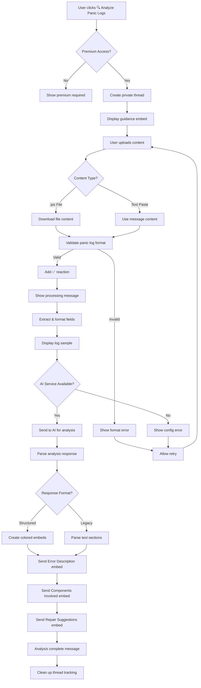

# Panic Log Analysis Discord Bot Flow

## Overview

The Panic Log Analysis feature is a Discord bot functionality that allows users to upload and analyze iPhone panic logs (.ips files) through a guided thread-based interaction. The bot uses AI to analyze the logs and provide detailed insights about device issues, components involved, and repair suggestions.

## Permission Requirements

- Only users with premium access (role ID: 1324737846371815435) can use this feature

## Flow Description

### 1. Initial Trigger

- User visits the **🧬│ᴘᴀɴɪᴄʟᴏɢ-ʀᴇᴀᴅᴇʀ** channel (ID: 1363837150679924736)
- Bot displays a welcome message with action buttons including "🔍 Analyze Panic Logs"

### 2. Permission Check

- When user clicks "🔍 Analyze Panic Logs" button, the bot performs permission validation:
  - Checks if user is bot owner (automatic access)
  - If not owner, validates premium role membership
  - If no premium access, displays premium required message and stops

### 3. Thread Creation

- Bot creates a private thread named `{username}'s Panic Log`
- Thread auto-archives after 60 minutes of inactivity
- Bot responds with ephemeral message containing clickable link to the thread

### 4. Guidance Display

- Bot posts welcome message in the thread mentioning the user
- Displays guidance embed with green color (0x2ecc71) containing:
  - **Title**: "Panic Log Analysis"
  - **Description**: Instructions for uploading panic logs
  - **Footer**: "Your panic log will only be visible in this private thread."

### 5. Log Upload Options

Users can provide panic logs in two ways:

- **File Upload**: Upload .ips files directly to the thread
- **Text Paste**: Copy and paste the content of the panic log

### 6. Content Validation

- Bot validates uploaded content:
  - For file uploads: Checks if filename ends with `.ips`
  - For text content: Uses pattern matching to detect panic log signatures
  - Validates message is from thread owner (original user)
- Bot adds ✅ reaction to acknowledge message receipt
- Displays "✅ Panic log received. Processing..." message

### 7. Log Processing Pipeline

#### 7.1 Content Extraction

- Downloads file content if uploaded as attachment
- Decodes bytes to UTF-8 text if necessary
- Extracts key fields using PanicLogParser:
  - Build version
  - Product identifier
  - Date/timestamp
  - Panic string
  - Stack trace information

#### 7.2 Content Formatting

- Formats extracted fields for AI analysis
- Handles parsing errors gracefully by using original content

#### 7.3 Log Sample Display

- Shows first 10 lines of panic log as a code block
- Truncates display if content exceeds 1800 characters
- Provides context for what's being analyzed

### 8. AI Analysis

#### 8.1 Service Validation

- Checks if AI service (OpenAI) is available and configured
- If unavailable, displays configuration error message

#### 8.2 Analysis Execution

- Sends typing indicator during processing
- Uses AI service to analyze panic log content
- Applies device knowledge injection for known products
- Processes through LangChain pipelines for structured output

#### 8.3 Results Processing

- Handles both structured (dict) and legacy (string) analysis formats
- Parses response into categorized sections

### 9. Response Delivery

#### 9.1 Structured Analysis Format (Preferred)

**Error Description Embed** (Red color - 0xe74c3c):

- Main error explanation
- Device model identification (if detected)

**Components Involved Embed** (Blue color - 0x3498db):

- List of hardware/software components affected
- Formatted as bullet points

**Repair Suggestions Embed** (Green color - 0x2ecc71):

- Component-specific repair instructions
- Numbered steps for each component
- Professional repair recommendations

#### 9.2 Legacy Analysis Format (Fallback)

- Parses section-based text format with markers like `[ERROR_DESCRIPTION]`
- Creates separate embeds for each identified section
- Falls back to raw analysis if no sections detected

### 10. Thread Completion

- Displays "✅ Analysis complete! You can close this thread when you're done."
- Removes thread from internal tracking dictionary
- Thread remains available for user review until auto-archived

### 11. Error Handling

- **File processing errors**: Shows specific error message and cleans up thread tracking
- **Analysis errors**: Displays generic error response and cleans up
- **Service unavailable**: Shows OpenAI configuration guidance
- **Invalid content**: Prompts user to upload valid .ips file or panic log text
- **Wrong file format**: Specifically mentions .ips file requirement
- **Failed reactions**: Silently ignored to prevent blocking flow

## Mermaid Flow Diagram



## Message Templates

### Guidance Content

```
Please upload your iPhone panic log (.ips file) in this thread. You can either:

• Upload the file directly
• Copy and paste the content of the file

Your log will be kept private in this thread.
```

### Thread Responses

- **Processing acknowledgment**: `"✅ Panic log received. Processing..."`
- **Invalid content**: `"I couldn't detect a valid panic log. Please upload a .ips file or copy-paste the content of the panic log."`
- **Wrong format**: `"The uploaded file doesn't appear to be an iPhone panic log (.ips file). Please upload a file with the .ips extension."`
- **Thread welcome**: `"{user_mention} Welcome to your private panic log thread."`
- **Completion**: `"✅ Analysis complete! You can close this thread when you're done."`

### Analysis Output Sections

1. **Error Description** (Red embed)

   - Main error explanation and cause
   - Device model identification

2. **Components Involved** (Blue embed)

   - Hardware components affected
   - Software systems involved

3. **Repair Suggestions** (Green embed)
   - Step-by-step repair instructions
   - Component-specific guidance
   - Professional recommendations

## Example User Inputs and Expected Responses

### Example 1: CPU Panic Log Upload

**User Input**: Uploads file `iPhone_panic_2024-01-15.ips` containing:

```
{"build" : "20E247", "product" : "iPhone13,1", "kernel" : "Darwin Kernel Version 23.1.0"}
panic(cpu 0 caller 0xfffffff02c3b1b84): "TLB invalidation IPI timeout: " @ /System/Library/Caches/com.apple.xbs/Sources/xnu/xnu-8019.141.5/osfmk/arm/pmap.c:2281
```

**Bot Response**:

1. ✅ reaction on message
2. "✅ Panic log received. Processing..."
3. **Sample from panic log (first few lines):**
   ```
   {"build" : "20E247", "product" : "iPhone13,1", "kernel" : "Darwin Kernel Version 23.1.0"}
   panic(cpu 0 caller 0xfffffff02c3b1b84): "TLB invalidation IPI timeout: "
   ```
4. **Error Description** (Red embed):

   - Title: "Error Description"
   - Description: "This panic indicates a TLB (Translation Lookaside Buffer) invalidation timeout, which suggests memory management issues in the iPhone 13 Mini. This type of error typically occurs when the CPU cannot properly invalidate memory mappings..."
   - Field: "Device Model: iPhone 13 Mini"

5. **Components Involved** (Blue embed):

   - Title: "Components Involved"
   - Description:
     ```
     - CPU Memory Management Unit (MMU)
     - Translation Lookaside Buffer (TLB)
     - ARM processor core
     - System memory (RAM)
     ```

6. **Repair Suggestions** (Green embed):

   - Title: "Repair Suggestions"
   - Description:

     ```
     **Memory Management Unit**
     1. Test with known good memory modules
     2. Check for loose RAM connections
     3. Inspect for physical damage to memory chips

     **CPU Core**
     1. Verify CPU is not overheating
     2. Check thermal paste application
     3. Test with CPU stress testing tools
     ```

7. "✅ Analysis complete! You can close this thread when you're done."

### Example 2: Invalid File Upload

**User Input**: Uploads file `crash_report.txt` (not .ips format)

**Bot Response**:

1. ✅ reaction on message
2. "✅ Panic log received. Processing..."
3. "The uploaded file doesn't appear to be an iPhone panic log (.ips file). Please upload a file with the .ips extension."

### Example 3: Text Paste Input

**User Input**: Pastes text:

```
panicString: "kernel data abort: pc=0xfffffff027e5b000 lr=0xfffffff027e5aff4 sp=0xfffffe5738b7b8e0"
BSD process name corresponding to current thread: MobileSafari
```

**Bot Response**:

1. ✅ reaction on message
2. "✅ Panic log received. Processing..."
3. **Sample from panic log** (showing first few lines)
4. Analysis embeds similar to Example 1, but focused on:
   - **Error Description**: Kernel data abort in MobileSafari process
   - **Components Involved**: Safari browser, kernel memory management
   - **Repair Suggestions**: App-specific troubleshooting steps

### Example 4: Non-panic Content

**User Input**: "My phone keeps crashing but I don't have a panic log"

**Bot Response**:

1. ✅ reaction on message
2. "✅ Panic log received. Processing..."
3. "I couldn't detect a valid panic log. Please upload a .ips file or copy-paste the content of the panic log."

### Example 5: AI Service Unavailable

**User Input**: Valid panic log when OpenAI is not configured

**Bot Response**:

1. ✅ reaction and processing message
2. Log sample display
3. **Cannot Analyze Panic Log** (Red embed):
   - Title: "Cannot Analyze Panic Log"
   - Description: "AI analysis is not available (API key not configured). Please configure the OpenAI API key in the .env file to use this feature."
4. Additional configuration guidance message

## Current Limitations

1. **File Format Restriction**: Only accepts .ips files for uploads (though text paste works for any format)
2. **Single Analysis**: Each thread processes one panic log at a time
3. **No Historical Tracking**: No database storage of analyzed logs or user history
4. **Manual Cleanup**: Thread data is only stored in memory during bot runtime
5. **Limited Device Knowledge**: Device-specific insights depend on knowledge base coverage
6. **No Batch Processing**: Cannot analyze multiple logs simultaneously
