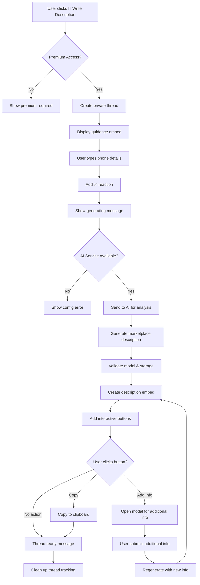

# Phone Description Discord Bot Flow

## Overview

The Phone Description feature is a Discord bot functionality that allows users to generate professional marketplace descriptions for their phones through a guided thread-based interaction. The bot uses AI to transform user-provided phone condition details into polished marketplace listings suitable for selling platforms.

## Permission Requirements

- Only users with premium access (role ID: 1324737846371815435) can use this feature

## Flow Description

### 1. Initial Trigger

- User visits the **✍️│ᴀᴜᴛᴏ-ᴅᴇꜱᴄʀɪᴘᴛɪᴏɴ** channel (ID: 1330130724732407841)
- Bot displays a welcome message with action buttons including "📝 Write Description"

### 2. Permission Check

- When user clicks "📝 Write Description" button, the bot performs permission validation:
  - Checks if user is bot owner (automatic access)
  - If not owner, validates premium role membership
  - If no premium access, displays premium required message and stops

### 3. Thread Creation

- Bot creates a private thread named `{username}'s Phone Description`
- Thread auto-archives after 60 minutes of inactivity
- Bot responds with ephemeral message containing clickable link to the thread

### 4. Guidance Display

- Bot posts welcome message in the thread mentioning the user
- Displays guidance embed with blue color (0x3498db) containing:
  - **Title**: "Phone Description Guidance"
  - **Description**: Instructions for providing phone details
  - **Footer**: "Type your details in this thread. I'll process your message automatically."

### 5. User Input Collection

- User types their phone condition details in any format they prefer
- Bot validates:
  - Message is from thread owner (original user)
  - Thread is in "collecting" status
- Bot adds ✅ reaction to acknowledge message receipt
- Bot stores message in thread tracking data

### 6. Description Generation Process

#### 6.1 Processing Initiation
- Bot displays: "Generating your phone description ..."
- Bot combines all user messages into a single detailed description

#### 6.2 AI Service Validation
- Checks if AI service (OpenAI) is available and configured
- If unavailable, displays configuration error message

#### 6.3 AI Analysis and Generation
- Sends combined details to AI service for marketplace description generation
- AI processes the input to create:
  - Professional marketplace title
  - Detailed listing description
  - Missing information analysis
  - Model and storage validation

#### 6.4 Content Validation
- Validates phone model against known models
- Validates storage size for the specific model
- Identifies missing information that could improve the listing

### 7. Response Delivery

#### 7.1 Initial Response
- Displays: "**Generating description based on:** {user_input}"

#### 7.2 Main Description Embed (Green color - 0x2ecc71)
**Primary Content:**
- **Title**: AI-generated marketplace title (e.g., "iPhone 13 Pro - Gold 256GB - Excellent Condition")
- **Description**: Professional marketplace listing text

**Validation Warnings (if applicable):**
- **⚠️ Model Verification Needed**: Warning about unrecognized phone models with suggestions
- **⚠️ Storage Verification Needed**: Warning about invalid storage sizes with available options
- **📋 Checklist**: List of missing information that could improve the listing

#### 7.3 Interactive Buttons
**Copy to Clipboard**: Allows users to copy the generated description
**Add Missing Info**: Opens modal to collect additional information and regenerate

### 8. Additional Information Flow (Optional)

#### 8.1 Add Missing Info Modal
- User clicks "Add Missing Info" button
- Modal opens with text input for additional details
- Placeholder text suggests what information to add

#### 8.2 Regeneration Process
- Combines original condition notes with new information
- Runs through AI generation process again
- Updates the embed with improved description
- Maintains the same interactive buttons

### 9. Thread Completion

- Displays "Your description is ready! You can close this thread when you're done."
- Removes thread from internal tracking dictionary
- Thread remains available for user review until auto-archived

### 10. Error Handling

- **Thread creation errors**: Shows generic error message and suggests retry
- **AI service unavailable**: Displays OpenAI configuration guidance
- **Generation errors**: Shows generic AI error response
- **Modal submission errors**: Provides feedback and allows retry

## Mermaid Flow Diagram



## Message Templates

### Guidance Content

```
Just type out the message your way, no need to follow a specific format.

Here's what we need:
1. Phone model, color and storage size (example: iPhone 13 Pro, Gold, 256GB)
2. Phone condition:
   • Any scratches, dents, or cosmetic issues
   • Screen condition (any cracks or scratches)
   • Working features and any non-working parts
3. Parts that have been replaced or repaired
4. Battery health percentage
5. What's included:
   • Warranty
   • Box/Charger/cable/Headphones
   • Case or screen protector
6. Any other important details about your phone
```

### Thread Responses

- **Processing acknowledgment**: `"Generating your phone description ..."`
- **Thread welcome**: `"{user_mention} Tell us about your phone in the next message.\n\nYou can refer to the guidance below for more details."`
- **Completion**: `"Your description is ready! You can close this thread when you're done."`
- **Based on message**: `"**Generating description based on:** {user_condition_details}"`

### UI Elements

- **Copy Button**: "Copy to Clipboard" - copies generated description
- **Add Info Button**: "Add Missing Info" - opens modal for additional details
- **Modal Title**: "Add Missing Information"
- **Modal Placeholder**: "Please provide details about: {missing_items}"

## Example User Inputs and Expected Responses

### Example 1: Complete Phone Description

**User Input**:
```
iPhone 13 Pro Max, Pacific Blue, 512GB. Excellent condition overall.
Screen is perfect with no scratches or cracks. Back has minor scratches
from normal use. Battery health is 89%. All features work perfectly.
Comes with original box, lightning cable, and case. No warranty remaining.
```

**Bot Response**:
1. ✅ reaction on message
2. "Generating your phone description ..."
3. **"Generating description based on:** iPhone 13 Pro Max, Pacific Blue, 512GB..."
4. **iPhone 13 Pro Max - Pacific Blue 512GB - Excellent Condition** (Green embed):
   - **Description**:
     ```
     **iPhone 13 Pro Max - Pacific Blue - 512GB**

     This iPhone 13 Pro Max is in excellent condition and ready for its next owner.
     The device features the stunning Pacific Blue finish with 512GB of storage space.

     **Condition Details:**
     • Screen: Perfect condition with no scratches or cracks
     • Back: Minor scratches from normal use, consistent with age
     • Battery Health: 89% - excellent performance
     • All features working perfectly

     **What's Included:**
     • Original box
     • Lightning cable
     • Protective case

     **Additional Notes:**
     • No warranty remaining
     • Well-maintained device perfect for daily use
     ```
   - **Interactive Buttons**: [Copy to Clipboard] [Add Missing Info]
5. "Your description is ready! You can close this thread when you're done."

### Example 2: Incomplete Information with Warnings

**User Input**:
```
iPhone 15 Ultra, 1TB, gold color. Good condition but screen has small crack.
Battery seems okay. Works fine.
```

**Bot Response**:
1. ✅ reaction on message
2. "Generating your phone description ..."
3. **"Generating description based on:** iPhone 15 Ultra, 1TB, gold color..."
4. **iPhone Listing - Gold** (Green embed):
   - **Description**:
     ```
     **iPhone - Gold**

     This gold iPhone is in good working condition with some cosmetic wear.

     **Condition Details:**
     • Screen: Small crack present but device functions normally
     • Battery: Good working condition
     • All features working properly
     ```
   - **---**
   - **⚠️ Model Verification Needed**:
     ```
     The model "iPhone 15 Ultra" was not recognized. Please verify the model name.
     Did you mean: iPhone 15 Pro Max, iPhone 15 Pro, iPhone 15?
     ```
   - **⚠️ Storage Verification Needed**:
     ```
     1TB storage is not available for most iPhone models. Please verify.
     Available options: 128GB, 256GB, 512GB
     ```
   - **📋 Checklist**:
     ```
     Consider adding these details to improve your listing:
     • Battery health percentage for accurate assessment
     • Details about included accessories (box, charger, etc.)
     • Warranty status and remaining coverage
     • Any repairs or part replacements
     ```
   - **Interactive Buttons**: [Copy to Clipboard] [Add Missing Info]
5. "Your description is ready! You can close this thread when you're done."

### Example 3: Add Missing Information Flow

**User Input**: Clicks "Add Missing Info" button after Example 2

**Bot Response**:
1. Modal opens with title "Add Missing Information"
2. **Text Input**:
   - Label: "Additional Information"
   - Placeholder: "Please provide details about: battery health percentage, included accessories, warranty status, repairs"

**User Submits Modal**:
```
Battery health is 85%. Comes with original box and charger but no headphones.
Device was purchased last year, no warranty left. No repairs done.
```

**Bot Response**:
1. "Generating your phone description ..."
2. **Updated Description Embed** with the additional information incorporated
3. Missing information checklist is reduced or removed
4. Model/storage warnings remain if not addressed

### Example 4: Minimal Input

**User Input**:
```
old iPhone, cracked screen, works
```

**Bot Response**:
1. ✅ reaction on message
2. "Generating your phone description ..."
3. **iPhone Listing** (Green embed):
   - **Description**:
     ```
     **iPhone - Working Condition**

     This iPhone is in working condition with some cosmetic damage.

     **Condition Details:**
     • Screen: Cracked but functional
     • Device works properly despite cosmetic issues
     ```
   - **📋 Checklist**:
     ```
     Consider adding these details to improve your listing:
     • Specific iPhone model (e.g., iPhone 12, iPhone 13 Pro)
     • Color and storage capacity
     • Battery health percentage
     • Extent of screen damage details
     • Included accessories information
     • Any warranty or repair history
     ```
4. "Your description is ready! You can close this thread when you're done."

### Example 5: AI Service Unavailable

**User Input**: Valid phone description when OpenAI is not configured

**Bot Response**:
1. ✅ reaction on message
2. "Generating your phone description ..."
3. Generic OpenAI error message with configuration guidance

## Current Limitations

1. **AI Dependency**: Requires OpenAI API configuration to function
2. **Single Generation Per Thread**: Each thread processes one description generation cycle
3. **No Historical Tracking**: No database storage of generated descriptions
4. **Manual Cleanup**: Thread data is only stored in memory during bot runtime
5. **Limited Model Validation**: Phone model validation depends on AI knowledge cutoff
6. **No Image Analysis**: Cannot analyze uploaded photos of devices
7. **No Price Suggestions**: Does not provide pricing recommendations
8. **Static Templates**: Cannot customize description format or tone significantly
9. **No Integration**: No direct integration with marketplace platforms for posting
10. **Memory Storage Only**: No persistent storage of user preferences or generated content