# Phone Grading Discord Bot Flow

## Overview

The Phone Grading feature is a Discord bot functionality that allows users to receive professional condition grades for their phones through a guided thread-based interaction. The bot uses AI to analyze user-provided device condition details and assign standardized grades (A+, A, B, C, D) with detailed explanations.

## Permission Requirements

- Only users with premium access (role ID: 1324737846371815435) can use this feature

## Flow Description

### 1. Initial Trigger

- User visits the **🧮│ᴅᴇᴠɪᴄᴇ-ɢʀᴀᴅᴇʀ** channel (ID: 1330129984068522004)
- Bot displays a welcome message with action buttons including "⭐ Grade Your Device"

### 2. Permission Check

- When user clicks "⭐ Grade Your Device" button, the bot performs permission validation:
  - Checks if user is bot owner (automatic access)
  - If not owner, validates premium role membership
  - If no premium access, displays premium required message and stops

### 3. Thread Creation

- Bot creates a private thread named `{username}'s Phone Grading`
- Thread auto-archives after 60 minutes of inactivity
- Bot responds with ephemeral message containing clickable link to the thread

### 4. Guidance Display

- Bot posts welcome message in the thread mentioning the user
- Displays guidance embed with blue color (0x3498db) containing:
  - **Title**: "Phone Grading Guidance"
  - **Description**: Instructions for providing device condition details
  - **Footer**: "Type your details in this thread. I'll process your message automatically."

### 5. User Input Collection

- User types their phone condition details in any format they prefer
- Bot validates:
  - Message is from thread owner (original user)
  - Thread is in "collecting" status
- Bot adds ✅ reaction to acknowledge message receipt
- Bot stores message in thread tracking data

### 6. Grade Generation Process

#### 6.1 Processing Initiation
- Bot displays: "Analyzing your phone's condition and generating a grade..."
- Bot combines all user messages into a single detailed description

#### 6.2 AI Service Validation
- Checks if AI service (OpenAI) is available and configured
- If unavailable, displays configuration error message

#### 6.3 AI Analysis and Grading
- Sends combined details to AI service for structured grading analysis
- AI processes the input to generate:
  - Letter grade (A+, A, B, C, D) with meaning
  - Detailed explanation of the grade rationale
  - Missing information analysis for accuracy improvement
  - Question detection and answering (if user asks questions)

#### 6.4 Grade Color Assignment
- **A+ or A**: Green color (0x2ecc71)
- **B**: Blue color (0x3498db)
- **C**: Orange color (0xff9800)
- **D**: Red color (0xe74c3c)

### 7. Response Delivery

#### 7.1 Initial Response
- Displays: "**Generating description based on:** {user_input}"

#### 7.2 Main Grade Embed (Color varies by grade)
**Primary Content:**
- **Title**: "📱 Phone Grade: {grade} ({grade_meaning})"
- **Explanation Field**: Detailed reasoning for the assigned grade

**Optional Question Answer (if detected):**
- **❓ Answer to Your Question**: Direct response to any questions in user input

**Missing Information Section (if applicable):**
- **Separator line**: "---"
- **📋 Checklist**: Numbered list of missing information that could improve grading accuracy
- **Footer**: "Click on Add Missing Info if you want to tell more."

#### 7.3 Interactive Button (if missing info exists)
**Add Missing Info**: Opens modal to collect additional information and regenerate grade

### 8. Additional Information Flow (Optional)

#### 8.1 Add Missing Info Modal
- User clicks "Add Missing Info" button (only appears if missing information detected)
- Modal opens with text input for additional details
- Automatically populates placeholder with relevant missing information questions

#### 8.2 Regeneration Process
- Combines original condition notes with new information
- Runs through AI grading process again with enhanced input
- Updates the embed with improved grade (may change letter grade)
- Maintains interactive functionality if still missing information

### 9. Thread Completion

- Displays "Your description is ready! You can close this thread when you're done."
- Removes thread from internal tracking dictionary
- Thread remains available for user review until auto-archived

### 10. Error Handling

- **Thread creation errors**: Shows generic error message and suggests retry
- **AI service unavailable**: Displays OpenAI configuration guidance
- **Generation errors**: Shows generic AI error response
- **Modal submission errors**: Provides feedback and allows retry
- **Regeneration errors**: Specific error handling for additional information processing

## Mermaid Flow Diagram

```mermaid
graph TD
    A[User clicks ⭐ Grade Your Device] --> B{Premium Access?}
    B -->|No| C[Show premium required]
    B -->|Yes| D[Create private thread]
    D --> E[Display guidance embed]
    E --> F[User types condition details]
    F --> G[Add ✅ reaction]
    G --> H[Show analyzing message]
    H --> I{AI Service Available?}
    I -->|No| J[Show config error]
    I -->|Yes| K[Send to AI for grading]
    K --> L[Generate grade and explanation]
    L --> M[Detect questions in input]
    M --> N[Check for missing information]
    N --> O[Assign grade color by letter]
    O --> P[Create grade embed]
    P --> Q{Missing Info Exists?}
    Q -->|No| R[Show grade only]
    Q -->|Yes| S[Add checklist and button]
    S --> T{User clicks Add Info?}
    T -->|Yes| U[Open modal for additional info]
    T -->|No| V[Thread ready message]
    U --> W[User submits additional info]
    W --> X[Regenerate with new info]
    X --> L
    R --> V
    V --> Y[Clean up thread tracking]
```



## Message Templates

### Guidance Content

```
Just type out the message your way, no need to follow a specific format.

You can tell us about:
1. Battery health percentage
2. Scratches, marks, or dings on the device
3. Screen condition (any cracks or scratches)
4. Any parts that have been replaced or repaired

The more details you provide, the more accurate our grading will be!
```

### Thread Responses

- **Processing acknowledgment**: `"Analyzing your phone's condition and generating a grade..."`
- **Thread welcome**: `"{user_mention} Tell us about your phone in the next message.\n\nYou can refer to the guidance below for more details."`
- **Completion**: `"Your description is ready! You can close this thread when you're done."`
- **Based on message**: `"**Generating description based on:** {user_condition_details}"`

### UI Elements

- **Add Info Button**: "Add Missing Info" - opens modal for additional details
- **Modal Title**: "Add Missing Information"
- **Modal Placeholder**: Dynamically generated based on missing information categories

### Grade Categories

**A+ Grade**: Perfect or near-perfect condition
**A Grade**: Excellent condition with minimal wear
**B Grade**: Good condition with some cosmetic wear
**C Grade**: Fair condition with noticeable wear or issues
**D Grade**: Poor condition with significant damage or problems

## Example User Inputs and Expected Responses

### Example 1: Complete Device Description - High Grade

**User Input**:
```
iPhone 14 Pro Max, Space Black, 256GB. Excellent condition overall.
Battery health is 92%. No scratches on screen or back.
All features work perfectly. Never dropped or damaged.
No repairs needed or done.
```

**Bot Response**:
1. ✅ reaction on message
2. "Analyzing your phone's condition and generating a grade..."
3. **"Generating description based on:** iPhone 14 Pro Max, Space Black, 256GB..."
4. **📱 Phone Grade: A (Excellent Condition)** (Green embed):
   - **Explanation**:
     ```
     Your iPhone 14 Pro Max is in excellent condition and deserves an A grade.
     The 92% battery health is outstanding for a device of this age, and the
     absence of any physical damage or repairs indicates careful ownership.
     All functional components are working properly, making this a premium
     device suitable for resale or continued use.
     ```
5. "Your description is ready! You can close this thread when you're done."

### Example 2: Moderate Condition with Missing Information

**User Input**:
```
iPhone 12, blue color. Screen works fine but has some scratches.
Phone works okay overall.
```

**Bot Response**:
1. ✅ reaction on message
2. "Analyzing your phone's condition and generating a grade..."
3. **"Generating description based on:** iPhone 12, blue color..."
4. **📱 Phone Grade: C (Fair Condition)** (Orange embed):
   - **Explanation**:
     ```
     Based on the information provided, your iPhone 12 receives a C grade
     for fair condition. The screen scratches are a notable cosmetic issue
     that affects the overall grade. However, full functionality suggests
     the device remains usable for daily tasks.
     ```
   - **---**
   - **📋 Checklist**:
     ```
     **1.** What is the battery health percentage?
     **2.** What is the cosmetic condition? Are there any scratches, marks, or dings on the frame/body?
     **3.** What is the repair/replacement history? Have any parts been replaced or repaired?
     ```
   - **Footer**: "Click on Add Missing Info if you want to tell more."
   - **Interactive Button**: [Add Missing Info]
5. "Your description is ready! You can close this thread when you're done."

### Example 3: Add Missing Information Flow

**User Input**: Clicks "Add Missing Info" button after Example 2

**Bot Response**:
1. Modal opens with title "Add Missing Information"
2. **Text Input**:
   - Label: "Additional Information"
   - Placeholder: "Please provide details about: battery health percentage, cosmetic condition, repair history"

**User Submits Modal**:
```
Battery health is 78%. Back has a few small dings on the corners.
No repairs done, all original parts.
```

**Bot Response**:
1. "Updated Grade with Additional Information:" (ephemeral)
2. **"Generating description based on:** iPhone 12, blue color. Screen works fine but has some scratches. Phone works okay overall.
Additional notes: Battery health is 78%. Back has a few small dings on the corners. No repairs done, all original parts.
3. **📱 Phone Grade: B (Good Condition)** (Blue embed):
   - **Explanation**:
     ```
     With the additional information, your iPhone 12 receives an upgraded B grade
     for good condition. The 78% battery health is acceptable for the device age,
     and while there are cosmetic issues including screen scratches and corner dings,
     the fact that all parts are original and no repairs were needed indicates
     solid build quality and reasonable care.
     ```
4. (No missing information section since all key details provided)

### Example 4: Question Detection and Poor Condition

**User Input**:
```
iPhone 11 with cracked screen and bad battery. Maybe 60% battery health?
Is this worth fixing or should I just sell it as-is?
```

**Bot Response**:
1. ✅ reaction on message
2. "Analyzing your phone's condition and generating a grade..."
3. **📱 Phone Grade: D (Poor Condition)** (Red embed):
   - **Explanation**:
     ```
     Your iPhone 11 receives a D grade due to significant issues. The cracked
     screen is a major cosmetic and potentially functional problem, while the
     60% battery health indicates replacement is needed soon. These issues
     substantially impact the device's value and usability.
     ```
   - **---**
   - **❓ Answer to Your Question**:
     ```
     Given the cracked screen and poor battery health, repair costs may exceed
     the device's post-repair value. Consider selling as-is for parts/repair
     unless you plan to keep it long-term. Screen and battery replacement
     together could cost $200-300, while the device might only be worth
     $250-350 after repairs.
     ```

### Example 5: Minimal Input with Extensive Missing Information

**User Input**:
```
old phone, works
```

**Bot Response**:
1. ✅ reaction on message
2. "Analyzing your phone's condition and generating a grade..."
3. **📱 Phone Grade: C (Fair Condition)** (Orange embed):
   - **Explanation**:
     ```
     Based on the very limited information provided, a conservative C grade
     is assigned. While the device reportedly works, the lack of specific
     details about condition, model, and other factors prevents a more
     accurate assessment.
     ```
   - **---**
   - **📋 Checklist**:
     ```
     **1.** What is the battery health percentage?
     **2.** What is the cosmetic condition? Are there any scratches, marks, or dings on the frame/body?
     **3.** What is the screen condition? Are there any scratches or cracks?
     **4.** What is the repair/replacement history? Have any parts been replaced or repaired?
     ```
   - **Footer**: "Click on Add Missing Info if you want to tell more."

### Example 6: AI Service Unavailable

**User Input**: Valid device description when OpenAI is not configured

**Bot Response**:
1. ✅ reaction on message
2. "Analyzing your phone's condition and generating a grade..."
3. Generic OpenAI error message with configuration guidance

## Current Limitations

1. **AI Dependency**: Requires OpenAI API configuration to function
2. **Single Grading Per Thread**: Each thread processes one grading cycle
3. **No Historical Tracking**: No database storage of generated grades or user history
4. **Manual Cleanup**: Thread data is only stored in memory during bot runtime
5. **Subjective Grading**: Grade assignments may vary based on AI interpretation
6. **No Image Analysis**: Cannot analyze uploaded photos of device condition
7. **No Market Value**: Does not provide pricing estimates or market value assessment
8. **Limited Categories**: Missing information detection limited to 4 predefined categories
9. **No Certification**: Grades are AI-generated estimates, not professional certifications
10. **Memory Storage Only**: No persistent storage of grades for future reference
11. **Standard Format**: Cannot customize grading criteria or scale
12. **No Appeals Process**: No mechanism to dispute or request grade reconsideration