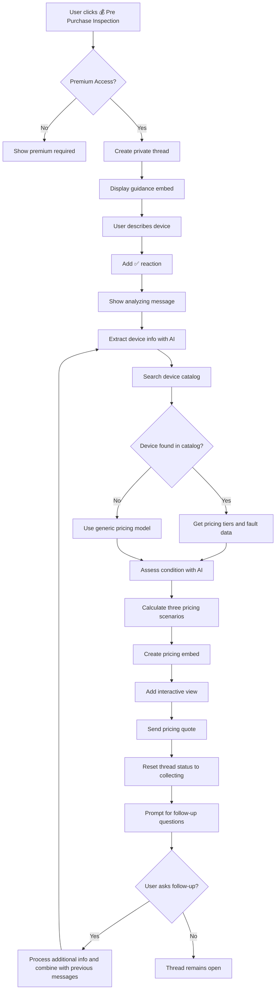
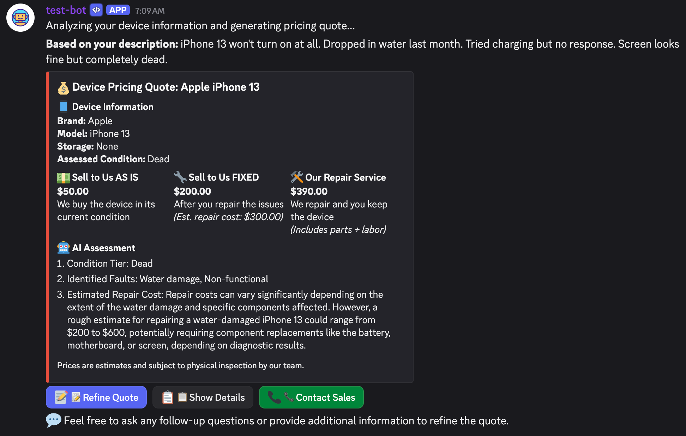

# Pre Purchase Inspection Discord Bot Flow

## Overview

The Pre Purchase Inspection feature is a Discord bot functionality that allows users to receive pricing quotes for devices they're considering purchasing through a guided thread-based interaction. The bot uses AI and device catalog integration via the Management Hub to analyze device descriptions and provide three pricing scenarios: AS IS purchase, FIXED purchase, and repair service options.

## Management Hub Integration

The bot integrates with the Cellzier Management Hub, a web-based dashboard that provides device catalog management and pricing data:

- **Management Hub URL**: `https://zrlwzphylf.execute-api.ap-southeast-2.amazonaws.com/admin/devices`
- **Purpose**: Centralized device catalog with pricing tiers and fault repair cost data
- **Data Source**: Contains device models, condition-based pricing, and repair cost estimates
- **Access**: Backend API integration for real-time pricing retrieval

## Permission Requirements

- Only users with premium access (role ID: 1324737846371815435) can use this feature

## Flow Description

### 1. Initial Trigger

- User visits the **🔍│ᴘʀᴇ-ᴘᴜʀᴄʜᴀsᴇ-ʙᴏᴛ** channel (ID: 1366386818311782441)
- Bot displays a welcome message with action buttons including "💰 Pre Purchase Inspection"

### 2. Permission Check

- When user clicks "💰 Pre Purchase Inspection" button, the bot performs permission validation:
  - Checks if user is bot owner (automatic access)
  - If not owner, validates premium role membership
  - If no premium access, displays premium required message and stops

### 3. Thread Creation

- Bot creates a private thread named `{username}'s Pre Purchase Inspection`
- Thread auto-archives after 60 minutes of inactivity
- Bot responds with ephemeral message containing clickable link to the thread

### 4. Guidance Display

- Bot posts welcome message in the thread mentioning the user
- Displays guidance embed with blue color (0x3498db) containing:
  - **Title**: "Pre Purchase Inspection Guidance"
  - **Description**: Instructions for providing device information
  - **Footer**: "Type your details in this thread. I'll process your message automatically."

### 5. Device Information Collection

- User types their device description including condition and any known issues
- Bot validates:
  - Message is from thread owner (original user)
  - Thread is in "collecting" status
- Bot adds ✅ reaction to acknowledge message receipt
- Bot stores message in thread tracking data

### 6. Pricing Analysis Process

#### 6.1 Processing Initiation
- Bot displays: "Analyzing your device information and generating pricing quote..."
- Bot combines all user messages into comprehensive device description

#### 6.2 AI Device Information Extraction
- Uses AI to extract structured device information:
  - Brand identification (Apple, Samsung, etc.)
  - Model identification (iPhone 15 Pro, Galaxy S24, etc.)
  - Storage capacity (128GB, 256GB, 512GB, 1TB)
  - Color (if mentioned)
  - Current condition assessment
  - Specific faults and issues mentioned

#### 6.3 Device Catalog Search
- Searches backend device catalog using extracted information via Management Hub API
- **API Endpoint**: `https://zrlwzphylf.execute-api.ap-southeast-2.amazonaws.com/admin/devices`
- Attempts to find matching device with pricing data from the management dashboard
- Retrieves condition-based pricing tiers and fault repair costs stored in the hub
- Accesses comprehensive fault data for each device model including:
  - Screen replacement costs
  - Battery replacement costs
  - Back glass repair costs
  - Camera repair costs
  - Speaker/audio repair costs
  - Logic board repair costs
- Handles catalog connection errors and device not found scenarios

#### 6.4 Condition Assessment
- Uses AI to assess device condition against standard tiers:
  - **Brand New**: Perfect condition, no issues
  - **New**: Excellent condition, minimal signs of use
  - **Working**: Good condition, fully functional with minor cosmetic issues
  - **Faulty**: Has issues but may be repairable
  - **Dead**: Not working, significant repair needed
  - **Damaged Functional**: Physical damage but still works
  - **Damaged Non-Functional**: Physical damage and doesn't work

#### 6.5 Pricing Calculations
- Calculates three pricing scenarios:
  1. **AS IS Price**: Current condition value from catalog
  2. **FIXED Price**: Working condition value minus estimated repair costs
  3. **Repair Service Cost**: Repair estimate plus 30% service markup

### 7. Response Delivery

#### 7.1 Initial Response
- Displays: "**Based on your description:** {user_device_description}"

#### 7.2 Main Pricing Embed (Color varies by condition)
**Device Information Section:**
- Brand, model, storage capacity
- Assessed condition tier

**Pricing Scenarios:**
- **💵 Sell to Us AS IS**: Immediate purchase price in current condition
- **🔧 Sell to Us FIXED**: Price after user repairs device (includes repair cost estimate)
- **🛠️ Our Repair Service**: Cost for professional repair service

**AI Assessment (if available):**
- Detailed reasoning for condition assessment and pricing

**Footer**: "Prices are estimates and subject to physical inspection by our team."

#### 7.3 Interactive Elements
- View with additional actions for refined quotes or follow-up questions

### 8. Follow-up Interaction Support

- Thread remains open for additional questions and clarifications
- Users can provide more details to refine pricing estimates
- Bot encourages follow-up: "💬 Feel free to ask any follow-up questions or provide additional information to refine the quote."
- **Improved Follow-up Handling**:
  - Bot automatically detects follow-up messages vs initial messages
  - Follow-up messages trigger refined quote generation with message "Analyzing your additional information and updating the quote..."
  - All previous messages are combined for comprehensive analysis
  - Thread status is properly reset to continue accepting messages

### 9. Error Handling

- **Device catalog unavailable**: Shows connection error with retry suggestion
- **Device not found**: Provides general pricing guidance
- **AI extraction errors**: Falls back to basic device information structure
- **Pricing calculation errors**: Shows error message with manual assessment offer

## Mermaid Flow Diagram



## Message Templates

### Guidance Content

```
Tell us about the device you're considering purchasing:

📱 **Device Information:**
• Brand, model, and storage (e.g., iPhone 15 Pro 256GB)
• Current condition (working/faulty/damaged)

🔧 **Issues/Faults:**
• Screen condition (cracks, scratches)
• Battery health (if known)
• Any cosmetic damage
• Functional issues (camera, speakers, etc.)

The more details you provide, the more accurate our pricing quote will be!

**Note:** This quote is preliminary and may change after our team's physical inspection.
```

### Thread Responses

- **Initial processing acknowledgment**: `"Analyzing your device information and generating pricing quote..."`
- **Follow-up processing acknowledgment**: `"Analyzing your additional information and updating the quote..."`
- **Thread welcome**: `"{user_mention} Tell us about your phone in the next message.\n\nYou can refer to the guidance below for more details."`
- **Follow-up prompt**: `"💬 Feel free to ask any follow-up questions or provide additional information to refine the quote."`
- **Based on message**: `"**Based on your description:** {user_device_description}"`

### Footer Text

- **Pricing disclaimer**: `"Prices are estimates and subject to physical inspection by our team."`

## Example User Inputs and Expected Responses

### Example 1: Working Device with Minor Issues

**User Input**:
```
iPhone 14 Pro Max 256GB Space Black. Screen is perfect, back has minor scratches.
Battery health is 89%. All features work fine. Considering selling because
I'm upgrading to iPhone 15.
```

**Bot Response**:
1. ✅ reaction on message
2. "Analyzing your device information and generating pricing quote..."
3. **"Based on your description:** iPhone 14 Pro Max 256GB Space Black. Screen is perfect..."
4. **💰 Device Pricing Quote: iPhone 14 Pro Max 256GB** (Blue embed):
   - **📱 Device Information**:
     ```
     Brand: Apple
     Model: iPhone 14 Pro Max
     Storage: 256GB
     Assessed Condition: Working
     ```
   - **💵 Sell to Us AS IS**:
     ```
     $850.00
     We buy the device in its current condition
     ```
   - **🔧 Sell to Us FIXED**:
     ```
     $900.00
     After you repair the issues
     (Est. repair cost: $0.00)
     ```
   - **🛠️ Our Repair Service**:
     ```
     $0.00
     We repair and you keep the device
     (Includes parts + labor)
     ```
   - **🤖 AI Assessment**:
     ```
     Device is in good working condition with minor cosmetic wear typical
     for normal use. 89% battery health is excellent for the device age.
     No functional issues identified.
     ```
   - **Footer**: "Prices are estimates and subject to physical inspection by our team."
5. "💬 Feel free to ask any follow-up questions or provide additional information to refine the quote."

### Example 2: Damaged Device with Multiple Issues

**User Input**:
```
Samsung Galaxy S22 Ultra 512GB. Screen is cracked but works. Back glass shattered.
Camera seems fine but speakers sound muffled. Still charges and works overall.
```

**Bot Response**:
1. ✅ reaction on message
2. "Analyzing your device information and generating pricing quote..."
3. **💰 Device Pricing Quote: Samsung Galaxy S22 Ultra 512GB** (Orange embed):
   - **📱 Device Information**:
     ```
     Brand: Samsung
     Model: Galaxy S22 Ultra
     Storage: 512GB
     Assessed Condition: Damaged Functional
     ```
   - **💵 Sell to Us AS IS**:
     ```
     $320.00
     We buy the device in its current condition
     ```
   - **🔧 Sell to Us FIXED**:
     ```
     $580.00
     After you repair the issues
     (Est. repair cost: $220.00)
     ```
   - **🛠️ Our Repair Service**:
     ```
     $286.00
     We repair and you keep the device
     (Includes parts + labor)
     ```
   - **🤖 AI Assessment**:
     ```
     Device has significant physical damage affecting screen and back glass,
     plus potential speaker issues. Despite damage, core functionality remains
     intact. Repair costs include screen replacement, back glass, and speaker
     service.
     ```
5. "💬 Feel free to ask any follow-up questions or provide additional information to refine the quote."

### Example 3: Dead Device

**User Input**:
```
iPhone 13 won't turn on at all. Dropped in water last month. Tried charging
but no response. Screen looks fine but completely dead.
```

**Bot Response**:
1. ✅ reaction on message
2. "Analyzing your device information and generating pricing quote..."
3. **💰 Device Pricing Quote: iPhone 13** (Red embed):
   - **📱 Device Information**:
     ```
     Brand: Apple
     Model: iPhone 13
     Storage: Unknown
     Assessed Condition: Dead
     ```
   - **💵 Sell to Us AS IS**:
     ```
     $120.00
     We buy the device in its current condition
     ```
   - **🔧 Sell to Us FIXED**:
     ```
     $350.00
     After you repair the issues
     (Est. repair cost: $300.00)
     ```
   - **🛠️ Our Repair Service**:
     ```
     $390.00
     We repair and you keep the device
     (Includes parts + labor)
     ```
   - **🤖 AI Assessment**:
     ```
     Water damage typically affects multiple internal components. Complete
     unresponsiveness suggests logic board damage. Repair requires professional
     liquid damage restoration which may not guarantee success.
     ```
5. "💬 Feel free to ask any follow-up questions or provide additional information to refine the quote."

**Screenshot Example:**


### Example 4: Device Not in Catalog

**User Input**:
```
Google Pixel 8a 128GB, mint condition. Just got Pixel 9 so selling this one.
Perfect working order, no issues at all.
```

**Bot Response**:
1. ✅ reaction on message
2. "Analyzing your device information and generating pricing quote..."
3. **💰 Device Pricing Quote: Google Pixel 8a 128GB** (Green embed):
   - **📱 Device Information**:
     ```
     Brand: Google
     Model: Pixel 8a
     Storage: 128GB
     Assessed Condition: New
     ```
   - **❌ Pricing Error**:
     ```
     Device not found in catalog. Please contact our team for a manual
     assessment of this device model.
     ```
5. "💬 Feel free to ask any follow-up questions or provide additional information to refine the quote."

### Example 5: Vague Description

**User Input**:
```
old iPhone, kinda broken
```

**Bot Response**:
1. ✅ reaction on message
2. "Analyzing your device information and generating pricing quote..."
3. **💰 Device Pricing Quote: iPhone** (Orange embed):
   - **📱 Device Information**:
     ```
     Brand: Apple
     Model: Unknown
     Storage: Unknown
     Assessed Condition: Faulty
     ```
   - **💵 Sell to Us AS IS**:
     ```
     $0.00
     We buy the device in its current condition
     ```
   - **🔧 Sell to Us FIXED**:
     ```
     $0.00
     After you repair the issues
     (Est. repair cost: $100.00)
     ```
   - **🛠️ Our Repair Service**:
     ```
     $130.00
     We repair and you keep the device
     (Includes parts + labor)
     ```
   - **🤖 AI Assessment**:
     ```
     Unable to provide accurate pricing without specific model information.
     Please provide iPhone model (e.g., iPhone 12, iPhone 13 Pro) and
     describe the specific issues for a detailed quote.
     ```
5. "💬 Feel free to ask any follow-up questions or provide additional information to refine the quote."

### Example 6: Follow-up Question

**User Input** (after Example 1):
```
What if the battery health was lower, like 75%?
```

**Bot Response**:
1. ✅ reaction on message
2. "Analyzing your additional information and updating the quote..."
3. **Updated pricing quote** with adjusted scenarios:
   - AS IS price slightly reduced due to battery condition
   - FIXED price includes battery replacement cost
   - Repair service includes battery replacement

### Example 7: Catalog Service Unavailable

**User Input**: Valid device description when backend catalog is unavailable

**Bot Response**:
1. ✅ reaction on message
2. "Analyzing your device information and generating pricing quote..."
3. **❌ Pricing Error**: "Unable to connect to device catalog service. Please try again later."

## Current Limitations

1. **Catalog Dependency**: Requires Management Hub API service for accurate pricing
2. **AI Accuracy**: Device information extraction may not be 100% accurate
3. **Estimation Only**: All prices are estimates subject to physical inspection
4. **Limited Device Support**: Only devices in Management Hub catalog receive accurate pricing
5. **Network Dependency**: Requires stable connection to Management Hub backend services
6. **No Image Analysis**: Cannot analyze uploaded photos of device condition
7. **Market Price Fluctuation**: Prices may not reflect current market conditions
8. **Hub-based Repair Estimates**: Repair costs come from Management Hub data, not live service quotes
9. **No Warranty Integration**: Cannot account for remaining warranty value
10. **Memory Storage Only**: No persistent storage of quotes or user preferences
11. **Single Device Analysis**: Cannot compare multiple devices in one quote
12. **No Authentication**: Cannot link quotes to user accounts for tracking
13. **Management Hub Availability**: Feature depends on Management Hub API uptime and accessibility