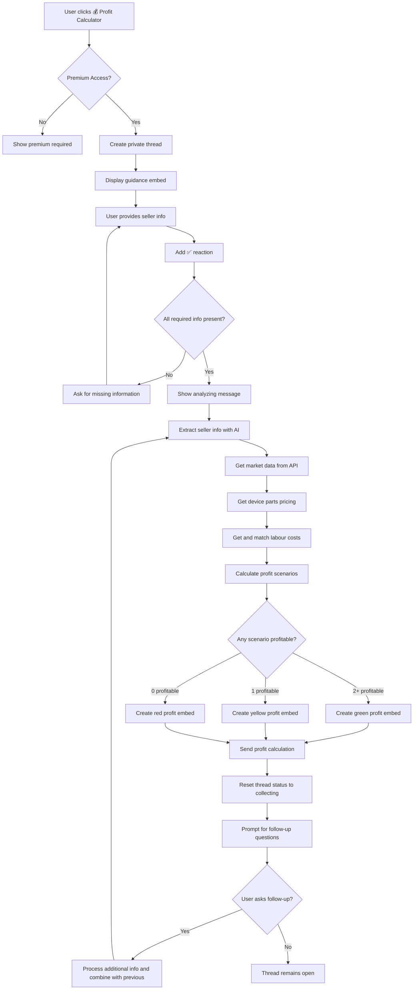
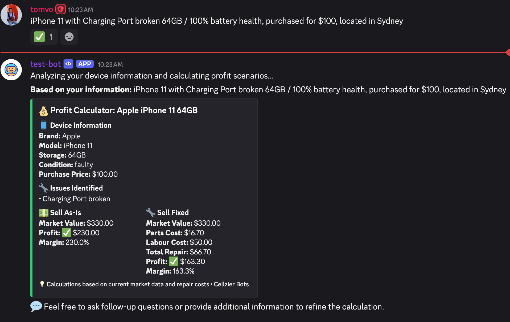

# Profit Calculator Discord Bot Flow

## Overview

The Profit Calculator feature is a Discord bot functionality that allows sellers to calculate potential profit from buying, repairing, and reselling devices through a guided thread-based interaction. The bot uses AI, device parts pricing, labour costs, and market data integration via the Management Hub to analyze seller information and provide two profit scenarios: Sell As-Is vs Sell Fixed with detailed profit margins.

## Management Hub Integration

The bot integrates with the Cellzier Management Hub, a web-based dashboard that provides device catalog, parts pricing, and labour cost data:

- **Management Hub URL**: `https://cellzier.sidekickmobile.com.au/admin/devices`
- **Device Parts API**: `/api/device-parts/` for parts pricing
- **Labour Costs API**: `/api/other-parts/labour` for repair labour costs
- **Market Data API**: `/api/market-data/` for current market values
- **Purpose**: Centralized pricing data for accurate profit calculations
- **Data Source**: Contains device parts, labour costs, and market pricing
- **Access**: Backend API integration for real-time pricing retrieval

## Permission Requirements

- Only users with premium access (role ID: 1324737846371815435) can use this feature

## Flow Description

### 1. Initial Trigger

- User visits the **💰│ᴘʀᴏꜰɪᴛ-ᴄᴀʟᴄᴜʟᴀᴛᴏʀ** channel (ID: 1366386817762463827)
- Bot displays a welcome message with action buttons including "💰 Profit Calculator"

### 2. Permission Check

- When user clicks "💰 Profit Calculator" button, the bot performs permission validation:
  - Checks if user is bot owner (automatic access)
  - If not owner, validates premium role membership
  - If no premium access, displays premium required message and stops

### 3. Thread Creation

- Bot creates a private thread named `{username}'s Profit Calculator`
- Thread auto-archives after 60 minutes of inactivity
- Bot responds with ephemeral message containing clickable link to the thread

### 4. Guidance Display

- Bot posts welcome message in the thread mentioning the user
- Displays guidance embed with blue color (0x3498db) containing:
  - **Title**: "💰 Profit Calculator"
  - **Description**: Instructions for providing seller and device information
  - **Footer**: "Type your details in this thread. I'll process your message automatically."

### 5. Seller Information Collection

- User types their device description including purchase price, condition, and damage issues
- Bot validates:
  - Message is from thread owner (original user)
  - Thread is in "collecting" status
- Bot adds ✅ reaction to acknowledge message receipt
- Bot stores message in thread tracking data

### 6. Information Validation

#### 6.1 Missing Information Check
- Bot checks if all required information is present:
  - Device model (iPhone, Samsung, etc.)
  - Purchase price (dollar amounts, "paid", "cost", etc.)
  - Current condition (working, faulty, damaged, etc.)
- If missing information, bot asks for specific details and keeps thread open

### 7. Profit Analysis Process

#### 7.1 Processing Initiation

- Bot displays: "Analyzing your device information and calculating profit scenarios..."
- Bot combines all user messages into comprehensive seller description

#### 7.2 AI Seller Information Extraction

- Uses AI to extract structured seller and device information:
  - Brand identification (Apple, Samsung, etc.)
  - Model identification (iPhone 15 Pro, Galaxy S24, etc.)
  - Storage capacity (128GB, 256GB, 512GB, 1TB)
  - Color (if mentioned)
  - Current condition assessment
  - Specific damage/issues mentioned (e.g., "cracked back and front")
  - Purchase price in dollars (extracts from various formats)
  - Location/city (if mentioned)

#### 7.3 Market Data Retrieval

- Searches market data API using extracted device information
- **API Endpoint**: `/api/market-data/`
- Retrieves current market statistics:
  - Median market price
  - 75th percentile price (for fixed condition)
  - Market trends and pricing data
- Handles API connection errors and device not found scenarios

#### 7.4 Device Parts Pricing

- Searches device parts API for repair part costs
- **API Endpoint**: `/api/device-parts/by-model/{model}`
- Retrieves parts pricing for the specific device model:
  - Screen replacement parts
  - Back glass replacement parts
  - Battery replacement parts
  - Camera replacement parts
  - Other component parts
- Matches damage issues to relevant parts using keyword matching

#### 7.5 Labour Cost Calculation

- Retrieves all labour costs from other parts API
- **API Endpoint**: `/api/other-parts/labour`
- Available labour categories:
  - Screen Replacement ($49.90)
  - Back Glass Replacement ($49.90)
  - Battery Replacement ($119.90)
  - Camera Replacement ($99.90)
  - Charging Port Replacement ($50.00)
  - Flex Cables Replacement ($199.90)
  - Full Housing Rebuild ($49.90)
  - Other (Parts Not Supplied) ($49.90)
- Uses direct string matching algorithm to match damage descriptions to labour costs
- **Implementation**: Smart scoring system prioritizes exact phrase matches over partial matches

### 8. Profit Scenario Calculations

#### 8.1 Sell As-Is Scenario
- **Formula**: Market Value (median) - Purchase Price = Profit
- **Profit Margin**: (Profit / Purchase Price) × 100
- Uses current market median price for as-is condition

#### 8.2 Sell Fixed Scenario
- **Formula**: Market Value (median) - Purchase Price - Parts Cost - Labour Cost = Profit
- **Profit Margin**: (Profit / Purchase Price) × 100
- Uses same market value as Sell As-Is scenario for fair comparison
- Deducts total repair costs (parts + labour) from profit calculation

### 9. Response Delivery

#### 9.1 Initial Response

- Displays: "**Based on your information:** {seller_device_description}"

#### 9.2 Main Profit Embed (Color varies by profitability)

**Device and Purchase Information Section:**

- Brand, model, storage capacity
- Current condition assessment
- Purchase price entered by seller

**Damage Issues Section (if any):**

- Bullet list of identified issues
- Matched to specific repair costs

**Profit Scenarios:**

- **💵 Sell As-Is**:
  ```
  Market Value: $XXX.XX
  Profit: ✅/❌ $XXX.XX
  Margin: XX.X%
  ```
- **🔧 Sell Fixed**:
  ```
  Market Value: $XXX.XX
  Parts Cost: $XXX.XX
  Labour Cost: $XXX.XX
  Total Repair: $XXX.XX
  Profit: ✅/❌ $XXX.XX
  Margin: XX.X%
  ```

**Color Coding:**
- **Green**: Both scenarios profitable (2+ profitable scenarios)
- **Yellow**: One scenario profitable (1 profitable scenario)
- **Red**: No scenarios profitable (0 profitable scenarios)
- **Blue**: Default/calculation in progress

**Footer**: "💡 Calculations based on current market data and repair costs • Cellzier Bots"

### 10. Follow-up Interaction Support

- Thread remains open for additional questions and clarifications
- Users can provide more details to refine profit calculations
- Bot encourages follow-up: "💬 Feel free to ask follow-up questions or provide additional information to refine the calculation."
- **Improved Follow-up Handling**:
  - Bot automatically detects follow-up messages vs initial messages
  - Follow-up messages trigger updated calculations with message "Updating your profit calculation with the new information..."
  - All previous messages are combined for comprehensive analysis
  - Thread status is properly reset to continue accepting messages

### 11. Error Handling

- **Market data unavailable**: Shows connection error with retry suggestion
- **Device model not identified**: Asks for specific model information
- **Purchase price missing**: Requests purchase price information
- **Parts/labour data unavailable**: Uses fallback estimates or shows error
- **API connection errors**: Graceful error messages with manual assessment offer

## Mermaid Flow Diagram



## Message Templates

### Guidance Content

```
💰 **Profit Calculator for Sellers**

To calculate your potential profit, please provide the following information:

📱 **Required Information:**
• **Device Model:** e.g., iPhone 13 Pro, Samsung Galaxy S22
• **Storage Capacity:** e.g., 128GB, 256GB, 512GB
• **Current Condition:** working, faulty, damaged, dead
• **Purchase Price:** How much you paid for the device
• **Specific Issues:** List any damage or problems (e.g., "cracked back and front", "battery dies quickly")

🌍 **Optional:**
• **Location:** Your city/region for market-specific pricing

📝 **Example Format:**
*"iPhone 11 with a cracked back and front 64GB / 100% battery health, purchased for $300, located in Sydney"*

I'll analyze your device and show you:
• **Sell As-Is** pricing and profit
• **Sell Fixed** pricing after repair costs
• Detailed profit margins and recommendations

Please provide your device information to get started!
```

### Thread Responses

- **Initial processing acknowledgment**: `"Analyzing your device information and calculating profit scenarios..."`
- **Follow-up processing acknowledgment**: `"Updating your profit calculation with the new information..."`
- **Thread welcome**: `"{user_mention} Tell us about your phone in the next message.\n\nYou can refer to the guidance below for more details."`
- **Follow-up prompt**: `"💬 Feel free to ask follow-up questions or provide additional information to refine the calculation."`
- **Based on message**: `"**Based on your information:** {seller_device_description}"`
- **Missing information request**: `"I need some additional information to calculate your profit:\n\n{missing_info}\n\nPlease provide the missing details."`

### Footer Text

- **Calculation disclaimer**: `"💡 Calculations based on current market data and repair costs • Cellzier Bots"`

## Example User Inputs and Expected Responses

### Example 1: Charging Port Repair Scenario (Real Implementation)

**User Input**:

```
iPhone 11 with Charging Port broken 64GB / 100% battery health, purchased for $100, located in Sydney
```

**Bot Response**:

1. ✅ reaction on message
2. "Analyzing your device information and calculating profit scenarios..."
3. **"Based on your information:** iPhone 11 with Charging Port broken 64GB / 100% battery health, purchased for $100, located in Sydney"
4. **💰 Profit Calculator: Apple iPhone 11 64GB** (Green embed):
   - **📱 Device Information**:
     ```
     Brand: Apple
     Model: iPhone 11
     Storage: 64GB
     Condition: faulty
     Purchase Price: $100.00
     ```
   - **🔧 Issues Identified**:
     ```
     • Charging Port broken
     ```
   - **💵 Sell As-Is**:
     ```
     Market Value: $330.00
     Profit: ✅ $230.00
     Margin: 230.0%
     ```
   - **🔧 Sell Fixed**:
     ```
     Market Value: $330.00
     Parts Cost: $16.70
     Labour Cost: $50.00
     Total Repair: $66.70
     Profit: ✅ $163.30
     Margin: 163.3%
     ```
   - **Footer**: "💡 Calculations based on current market data and repair costs • Cellzier Bots"
5. "💬 Feel free to ask follow-up questions or provide additional information to refine the calculation."


*Screenshot showing the actual bot response with correct calculations*

### Example 2: Unprofitable Scenario

**User Input**:

```
Samsung Galaxy S21 Ultra 512GB, screen cracked, back shattered, camera broken,
battery drains fast. Paid $800 for it last month.
```

**Bot Response**:

1. ✅ reaction on message
2. "Analyzing your device information and calculating profit scenarios..."
3. **💰 Profit Calculator: Samsung Galaxy S21 Ultra 512GB** (Red embed):
   - **📱 Device Information**:
     ```
     Brand: Samsung
     Model: Galaxy S21 Ultra
     Storage: 512GB
     Condition: damaged
     Purchase Price: $800.00
     ```
   - **🔧 Issues Identified**:
     ```
     • screen cracked
     • back shattered
     • camera broken
     • battery drains fast
     ```
   - **💵 Sell As-Is**:
     ```
     Market Value: $450.00
     Profit: ❌ -$350.00
     Margin: -43.8%
     ```
   - **🔧 Sell Fixed**:
     ```
     Market Value: $650.00
     Parts Cost: $280.00
     Labour Cost: $298.70
     Total Repair: $578.70
     Profit: ❌ -$728.70
     Margin: -91.1%
     ```

### Example 3: Mixed Profitability

**User Input**:

```
iPhone 12 64GB, working fine but screen has minor scratches. Battery health
85%. Got it for $350 from a friend.
```

**Bot Response**:

1. ✅ reaction on message
2. **💰 Profit Calculator: iPhone 12 64GB** (Yellow embed):
   - **💵 Sell As-Is**:
     ```
     Market Value: $420.00
     Profit: ✅ $70.00
     Margin: 20.0%
     ```
   - **🔧 Sell Fixed**:
     ```
     Market Value: $480.00
     Parts Cost: $95.00
     Labour Cost: $169.80
     Total Repair: $264.80
     Profit: ❌ -$134.80
     Margin: -38.5%
     ```

### Example 4: Missing Information

**User Input**:

```
iPhone with broken screen, paid some money for it
```

**Bot Response**:

1. ✅ reaction on message
2. "I need some additional information to calculate your profit:"
3. Missing information list:
   ```
   • 📱 **Device Model** (e.g., iPhone 13 Pro, Galaxy S22)
   • 💰 **Purchase Price** (how much you paid for it)
   ```
4. "Please provide the missing details."

### Example 5: Follow-up Question

**User Input** (after Example 1):

```
What if I also replaced the battery? Would that increase the profit?
```

**Bot Response**:

1. ✅ reaction on message
2. "Updating your profit calculation with the new information..."
3. **Updated profit calculation** with additional battery replacement costs:
   - Fixed scenario now includes battery replacement parts and labour
   - Reduced profit margin due to additional repair costs
   - Market value potentially higher due to better condition

### Example 6: Market Data Unavailable

**User Input**: Valid device description when market data API is unavailable

**Bot Response**:

1. ✅ reaction on message
2. "Analyzing your device information and calculating profit scenarios..."
3. **❌ Calculation Error**: "Market data not available. Please try again later or contact our team for manual assessment."

### Example 7: Device Model Not Found

**User Input**:

```
Google Pixel Fold 256GB, mint condition, paid $1200 for it
```

**Bot Response**:

1. ✅ reaction on message
2. **💰 Profit Calculator: Google Pixel Fold 256GB** (Blue embed):
   - **💵 Sell As-Is**:
     ```
     ❌ Market data not available
     ```
   - **🔧 Sell Fixed**:
     ```
     ❌ Insufficient data for fixed scenario calculation
     ```

## Current Limitations

1. **API Dependency**: Requires Management Hub APIs for accurate calculations
2. **AI Accuracy**: Device information extraction may not be 100% accurate
3. **Market Estimation**: Prices based on current data, subject to market fluctuations
4. **Limited Device Support**: Only devices with market data receive accurate calculations
5. **Network Dependency**: Requires stable connection to backend services
6. **No Image Analysis**: Cannot analyze uploaded photos of device condition
7. **Simple Parts Matching**: Basic keyword matching for damage to parts correlation
8. **No Shipping Costs**: Calculations don't include shipping or transaction fees
9. **Memory Storage Only**: No persistent storage of calculations or user preferences
10. **Single Device Analysis**: Cannot compare multiple devices in one calculation
11. **No Market Trends**: Cannot show historical pricing trends or future predictions
12. **Location Generalization**: Market data may not reflect specific local markets
13. **No Warranty Value**: Cannot account for remaining warranty value in calculations
14. **Static Labour Costs**: Labour costs are fixed, not based on location or complexity variations
15. **No Bulk Calculations**: Cannot calculate profits for multiple devices simultaneously

## Integration Points

### Backend APIs Used

- **Device Parts API**: `/api/device-parts/by-model/{model}` - Parts pricing with exact model matching
- **Labour Costs API**: `/api/other-parts/labour` - Repair labour costs retrieval
- **Market Data API**: `/api/market-data/` - Current market pricing for devices

### AI Services

- **Device Information Extraction**: Parses natural language device descriptions using OpenAI/TogetherAI
- **Damage Assessment**: Identifies specific repair needs from descriptions
- **Smart Matching Algorithms**: Direct string matching with scoring for parts and labour

### Implementation Details

- **Parts Matching**: Smart scoring system prioritizes exact phrase matches (score 30) over partial matches (score 5)
- **Labour Matching**: Direct string matching with keyword scoring, minimum threshold of 10 points
- **Type Safety**: Automatic string-to-float conversion for pricing data
- **Error Handling**: Graceful fallbacks for API failures and missing data
- **Session Management**: Single aiohttp session for all API calls to prevent connection issues

### Thread Management

- **ProfitCalculatorHandler**: Manages thread lifecycle and message processing
- **ProfitCalculatorGenerator**: Core calculation engine and API integration
- **BaseThreadHandler**: Inherited thread management functionality

## Technical Improvements & Fixes Applied

### 🔧 **Smart Parts Matching Algorithm**

**Problem**: Bot was matching "Wireless Charging Coil" ($4.90) instead of "Charging Port" ($16.70) for "charging port broken"

**Solution**: Implemented scoring system:
- **Score 30**: Exact phrase match ("charging port" in part name)
- **Score 25**: Both keywords present ("charging" AND "port")
- **Score 5**: Partial match only ("charging" without "port")
- **Minimum threshold**: Score ≥15 required for part selection

### 🔧 **Enhanced Labour Matching**

**Problem**: Labour API calls were failing due to session management issues

**Solution**:
- Replaced API-dependent matching with direct string scoring
- Fetch all labour data in single session
- Smart keyword matching with confidence scoring
- Handles "Charging Port broken" → "Charging Port Replacement ($50.00)"

### 🔧 **Market Value Consistency**

**Problem**: As-Is ($330) and Fixed ($350) scenarios had different market values

**Solution**: Both scenarios now use same median market price for fair comparison

### 🔧 **Type Safety & Error Handling**

**Problem**: `TypeError: unsupported operand type(s) for +=: 'int' and 'str'`

**Solution**:
- Automatic string-to-float conversion for all pricing data
- Graceful error handling for invalid price values
- Comprehensive debug logging for troubleshooting

### 🔧 **Exact Model Matching**

**Problem**: "iPhone 11" was matching parts for "iPhone 11 Pro", "iPhone 11 Pro Max"

**Solution**: Changed backend API from substring matching (`in`) to exact matching (`==`)