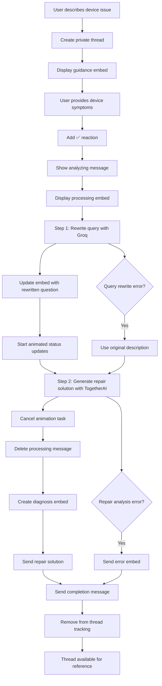
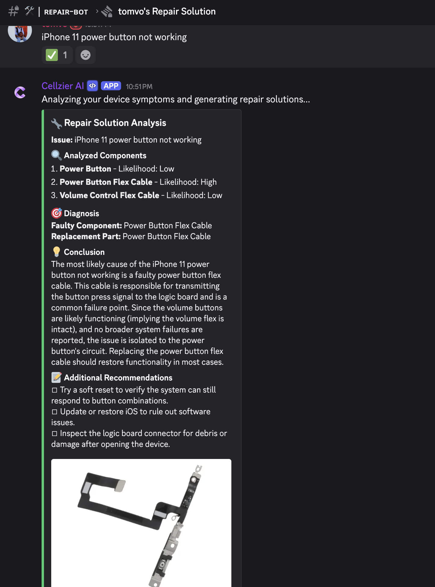

# Repair Solution Discord Bot Flow

## Overview

The Repair Solution feature is a Discord bot functionality that provides users with detailed device repair guidance through a guided thread-based interaction. The bot uses a sophisticated two-step AI workflow with Groq and TogetherAI to analyze device symptoms, rewrite user queries for better understanding, and generate comprehensive repair solutions with step-by-step instructions.

## AI Services Integration

The bot uses a sophisticated two-step AI workflow:

- **Step 1 - Query Rewriter (Groq)**: Analyzes and rewrites user device descriptions for better clarity and technical accuracy
- **Step 2 - Repair Analysis (TogetherAI)**: Generates detailed repair solutions based on the rewritten query
- **Purpose**: Provides accurate, actionable repair guidance with step-by-step instructions
- **Processing**: Real-time AI analysis with animated status updates during processing

## Permission Requirements

- Available to all users (no premium access required)

## Flow Description

### 1. Initial Trigger

- User interacts with repair solution buttons in Discord channels
- Bot displays repair solution options with action buttons

### 2. Thread Creation

- Bot creates a private thread named `{username}'s Repair Solution`
- Thread auto-archives after configured duration (THREAD_AUTO_ARCHIVE_DURATION)
- Bot responds with ephemeral message containing clickable link to the thread

### 3. Guidance Display

- Bot posts welcome message in the thread mentioning the user
- Displays guidance embed with blue color containing:
  - **Title**: From REPAIR_SOLUTION["embed_title"]
  - **Description**: Instructions for providing device symptoms and issues
  - **Footer**: "Type your details in this thread. I'll process your message automatically."

### 4. Device Issue Collection

- User types their device symptoms, issues, and repair questions
- Bot validates:
  - Message is not from a bot
  - Message is in a thread
  - Thread name contains "Repair Solution"
- Bot adds ✅ reaction to acknowledge message receipt
- Bot stores message in thread tracking data with status "collecting"

### 5. Repair Analysis Process

#### 5.1 Processing Initiation
- Bot displays: "Analyzing your device symptoms and generating repair solutions..."
- Bot prepares for two-step AI analysis workflow

#### 5.2 Step 1: Query Rewriting (Groq)
- Uses QueryRewriter service to analyze and improve the user's device description
- Extracts and clarifies:
  - Device model and specifications
  - Specific symptoms and issues
  - Technical terminology standardization
  - Context enhancement for better repair analysis

#### 5.3 Processing Status Animation
- Displays animated processing embed with:
  - Initial processing message
  - Rewritten question display
  - Rotating status messages every 3 seconds
  - Entertaining progress indicators

#### 5.4 Step 2: Repair Solution Generation (TogetherAI)
- Uses RepairSolutionService to generate comprehensive repair guidance
- Analyzes the rewritten query for:
  - Root cause identification
  - Repair difficulty assessment
  - Required tools and parts
  - Step-by-step repair instructions
  - Safety warnings and precautions

#### 5.5 Solution Formatting
- Creates diagnosis embed using RepairSolutionFormatter
- Includes:
  - Original user question
  - Rewrite analysis results
  - Detailed troubleshoot results
  - Visual formatting with appropriate colors

### 6. Response Delivery

#### 6.1 Processing Animation Management
- Cancels animated status updates when analysis completes
- Deletes processing message to clean up thread

#### 6.2 Main Repair Solution Embed
**Device Analysis Section:**
- Original issue description
- Rewritten technical analysis
- Identified problems and symptoms

**Repair Guidance:**
- Step-by-step repair instructions
- Required tools and parts list
- Difficulty level assessment
- Safety warnings and precautions
- Alternative solutions if applicable

**Footer**: Standard repair disclaimer and safety notice

#### 6.3 Thread Completion
- Sends completion message: "Your repair solution is ready! You can close this thread when you're done."
- Removes thread from tracking system
- Thread remains open for user reference

### 7. Error Handling

- **AI Service Unavailable**: Shows connection error with retry suggestion
- **Query Rewriting Errors**: Falls back to original description
- **Repair Analysis Errors**: Shows error embed with manual assistance offer
- **Processing Errors**: Graceful error handling with user-friendly messages

## Mermaid Flow Diagram



## Message Templates

### Guidance Content

```
Tell us about your device issue or repair question:

🔧 **Device Information:**
• Brand, model, and storage (e.g., iPhone 15 Pro 256GB)
• Specific symptoms or problems you're experiencing

🛠️ **Issue Details:**
• When did the problem start?
• What were you doing when it occurred?
• Any error messages or unusual behavior
• Previous repair attempts

The more details you provide, the more accurate our repair guidance will be!

**Note:** Our repair solutions are for informational purposes only. Always prioritize safety and consider professional repair services for complex issues.
```

### Thread Responses

- **Processing acknowledgment**: `"Analyzing your device symptoms and generating repair solutions..."`
- **Thread welcome**: `"{user_mention} Tell us about your device issue in the next message.\n\nYou can refer to the guidance below for more details."`
- **Completion message**: `"Your repair solution is ready! You can close this thread when you're done."`

### Processing Status Messages

- Animated status indicators during AI processing
- Rewritten question display for transparency
- Progress updates every 3 seconds

## Example User Inputs and Expected Responses

### Example 1: Screen Issue

**User Input**:
```
iPhone 13 Pro screen is flickering and has weird colors sometimes. Started after I dropped it last week. Touch still works but display is messed up.
```

**Bot Response**:
1. ✅ reaction on message
2. "Analyzing your device symptoms and generating repair solutions..."
3. **Processing embed** with animated status updates
4. **Repair Solution Embed**:
   - **Original Issue**: User's description
   - **Rewritten Analysis**: Technical breakdown of display issues
   - **Repair Guidance**: Step-by-step screen replacement instructions
   - **Tools Required**: Specific tools and parts needed
   - **Safety Warnings**: Precautions for display repair
5. "Your repair solution is ready! You can close this thread when you're done."

### Example 2: Power Button Issue (Actual Bot Output)

**User Input**:
```
iPhone 11 power button not working
```

**Bot Response**:
1. ✅ reaction on message
2. "Analyzing your device symptoms and generating repair solutions..."
3. **Repair Solution Analysis** (as shown below):



*Figure: Actual repair solution output showing component analysis, diagnosis, and repair recommendations for iPhone 11 power button issue*

The bot provides:
- **Issue**: Clear problem identification
- **Analyzed Components**: Power Button, Power Button Flex Cable, Volume Control Flex Cable with likelihood assessments
- **Diagnosis**: Identifies faulty component and replacement part needed
- **Conclusion**: Detailed technical explanation of the root cause
- **Additional Recommendations**: Software troubleshooting steps to try first
- **Visual Component**: Image showing the actual power button flex cable part

### Example 3: Battery Problem

**User Input**:
```
Samsung Galaxy S21 battery draining super fast. Goes from 100% to 20% in like 3 hours
even when I'm not using it much. Started happening after the last update.
```

**Bot Response**:
1. ✅ reaction on message
2. "Analyzing your device symptoms and generating repair solutions..."
3. **Repair Solution Analysis** (Blue embed):
   ```
   **Device Model:** Samsung Galaxy S21

   **Issue Diagnosis:**
   Rapid battery drain after a software update typically indicates software-related issues rather than hardware failure. This could be caused by background apps, system processes, or battery calibration issues following the update.

   **Recommended Solutions:**
   Before replacing hardware, try these software fixes:

   **Software Troubleshooting (Try First):**
   1. Check battery usage in Settings > Battery to identify problem apps
   2. Restart the device and monitor for 24 hours
   3. Update all apps through Galaxy Store/Play Store
   4. Clear cache partition through recovery mode
   5. Disable unnecessary background app refresh
   6. Reset network settings if the issue persists

   **Hardware Solution (If Software Fixes Fail):**
   • Galaxy S21 Battery Replacement (EB-BG991ABY)

   **Difficulty Level:** Difficult (for hardware replacement)

   **Hardware Repair Instructions:**
   ⚠️ **WARNING:** Galaxy S21 uses strong adhesive and has a high risk of screen damage during opening.

   1. Heat the back panel to soften adhesive
   2. Use suction cup and opening picks to remove back glass
   3. Disconnect battery flex cable
   4. Remove wireless charging coil
   5. Pull battery removal tabs (if available) or use adhesive remover
   6. Install new battery with proper adhesive strips
   7. Reassemble ensuring all gaskets are properly seated

   **Professional Recommendation:**
   Try all software solutions first as they resolve 80% of post-update battery issues. If hardware replacement is needed, professional service is strongly recommended due to the high risk of screen damage and waterproofing concerns. Professional battery replacement typically costs $120-180.
   ```
4. "Your repair solution is ready! You can close this thread when you're done."

### Example 4: Vague Description

**User Input**:
```
my phone is broken
```

**Bot Response**:
1. ✅ reaction on message
2. "Analyzing your device symptoms and generating repair solutions..."
3. **Repair Solution Analysis** (Blue embed):
   ```
   **Device Model:** Unable to determine from description

   **Issue Diagnosis:**
   Your description indicates a device problem, but more specific information is needed for accurate diagnosis.

   **Additional Information Needed:**
   To provide the most helpful repair solution, please provide:

   1. **Device Model:** What specific phone model do you have? (e.g., iPhone 13, Samsung Galaxy S22, Google Pixel 6)

   2. **Specific Symptoms:** What exactly is wrong?
      • Screen not turning on?
      • Physical damage (cracked screen, water damage)?
      • Software issues (freezing, apps crashing)?
      • Battery problems?
      • Charging issues?
      • Audio/speaker problems?

   3. **When it started:** Did this happen suddenly or gradually?

   4. **What you were doing:** Were you using the phone when the problem started?

   **General Troubleshooting Steps:**
   While you gather more details, try these basic steps:
   1. Force restart your device (hold power + volume down for 10+ seconds)
   2. Check if the device charges when plugged in
   3. Look for obvious physical damage
   4. Try using the device in safe mode if it powers on

   **Next Steps:**
   Please provide more specific details about your device model and symptoms for a targeted repair solution. You can send another message in this thread with the additional information.
   ```
4. "Your repair solution is ready! You can close this thread when you're done."

### Example 5: Water Damage

**User Input**:
```
iPhone 13 Pro Max dropped in water yesterday. Screen flickers sometimes, charging port
doesn't work, and speakers sound muffled. It still turns on but camera app crashes.
```

**Bot Response**:
1. ✅ reaction on message
2. "Analyzing your device symptoms and generating repair solutions..."
3. **Repair Solution Analysis** (Blue embed):
   ```
   **Device Model:** iPhone 13 Pro Max

   **Issue Diagnosis:**
   Water damage has affected multiple systems in your device. The symptoms indicate liquid infiltration into the charging port, speaker assembly, display connectors, and possibly the camera module. This is a complex multi-component failure requiring comprehensive repair.

   **Immediate Actions Required:**
   🚨 **STOP using the device immediately** to prevent further damage
   1. Power off the device completely
   2. Do NOT attempt to charge
   3. Place in rice or silica gel packets for 48-72 hours
   4. Do NOT use heat sources (hair dryer, oven, etc.)

   **Affected Components Requiring Replacement:**
   • Lightning Port/Charging Assembly
   • Bottom Speaker Assembly
   • Display (potential connector corrosion)
   • Rear Camera Module (if corrosion detected)
   • Logic Board Cleaning (professional required)

   **Difficulty Level:** Expert/Professional Only

   **Professional Repair Required:**
   This level of water damage requires:
   • Ultrasonic cleaning of the logic board
   • Microscopic inspection for corrosion
   • Component-level diagnosis and replacement
   • Professional liquid damage assessment

   **Cost Estimate:**
   • Professional diagnostic: $50-100
   • Repair costs: $200-500 depending on component damage
   • Total repair may approach 60-80% of device replacement cost

   **Important Considerations:**
   ⚠️ Water damage repairs often reveal additional problems during service
   ⚠️ Some damage may not be immediately apparent
   ⚠️ Data recovery should be prioritized if device contains important information

   **Recommendation:**
   Given the extent of damage affecting multiple systems, professional evaluation is essential. Many repair shops offer free diagnostics for water damage. Consider device replacement if repair costs exceed 70% of replacement cost.

   **Data Recovery:**
   If the device contains irreplaceable data, prioritize professional data recovery services before attempting any repairs.
   ```
4. "Your repair solution is ready! You can close this thread when you're done."

### Example 6: AI Service Unavailable

**User Input**: Valid device issue when OpenAI is not configured

**Bot Response**:
1. ✅ reaction on message
2. "Analyzing your device symptoms and generating repair solutions..."
3. Generic OpenAI error message with configuration guidance

### Example 7: Preventive Maintenance Question

**User Input**:
```
iPhone 14 running fine but battery health is at 82%. Should I replace it now or wait?
When do iPhone batteries typically need replacement?
```

**Bot Response**:
1. ✅ reaction on message
2. "Analyzing your device symptoms and generating repair solutions..."
3. **Repair Solution Analysis** (Blue embed):
   ```
   **Device Model:** iPhone 14

   **Current Status Assessment:**
   Your iPhone 14 battery health at 82% is still within acceptable range but approaching the threshold where replacement becomes beneficial for optimal performance.

   **Battery Health Guidelines:**
   • 100-90%: Excellent condition
   • 89-80%: Good condition, monitor performance
   • 79-70%: Fair condition, replacement recommended
   • Below 70%: Poor condition, replacement needed

   **Replacement Recommendation:**
   **Wait and Monitor** - Your 82% battery health doesn't require immediate replacement, but start planning for replacement when it drops below 80%.

   **Signs It's Time to Replace:**
   • Battery health drops below 80%
   • Unexpected shutdowns during normal use
   • Significantly reduced screen-on time
   • Device feels sluggish (iOS may throttle performance)
   • Battery drains rapidly even with minimal use

   **Typical iPhone Battery Lifespan:**
   • iPhone batteries typically last 2-3 years with normal use
   • 500-1000 complete charge cycles before significant degradation
   • Usage patterns significantly affect lifespan

   **Proactive Maintenance Tips:**
   1. Avoid extreme temperatures (hot cars, direct sunlight)
   2. Don't let battery completely drain regularly
   3. Use optimized battery charging (enabled by default)
   4. Remove case during charging if device gets warm
   5. Keep iOS updated for battery optimization

   **When You're Ready to Replace:**
   **Difficulty Level:** Moderate
   **Estimated Cost:** $80-120 (professional) / $30-50 (DIY)
   **Time Required:** 30-60 minutes (professional) / 2-3 hours (DIY)

   **Professional vs DIY:**
   • Professional: Warranty, proper disposal, guaranteed waterproofing
   • DIY: Lower cost, but risk of damage and waterproofing loss

   **Current Recommendation:**
   Continue using your device normally while monitoring battery performance. Plan for replacement in the next 6-12 months or when you notice performance impacts.
   ```
4. "Your repair solution is ready! You can close this thread when you're done."

## Technical Implementation Details

### Thread Management
- **Class-level tracking**: `RepairSolutionHandler.threads = {}`
- **Service initialization**: Lazy loading of `RepairSolutionService`
- **Status tracking**: Thread status management for message processing
- **Cleanup**: Automatic thread removal after solution delivery

### AI Workflow
- **Query Rewriter**: Groq-based query improvement
- **Repair Analysis**: TogetherAI-based solution generation
- **Processing Animation**: Async status updates with cancellation handling
- **Error Recovery**: Graceful fallbacks for each AI step

### Message Processing
- **Single-shot processing**: Each user message triggers complete analysis
- **No follow-up support**: Thread closes after solution delivery
- **Reaction acknowledgment**: ✅ emoji for user feedback
- **Clean completion**: Thread tracking cleanup after processing

## Current Limitations

1. **No Follow-up Support**: Unlike pre-purchase inspection, threads don't support additional questions
2. **Single Analysis**: Each message triggers a complete new analysis workflow
3. **AI Service Dependency**: Requires both Groq and TogetherAI services to be available
4. **No Image Analysis**: Cannot analyze uploaded photos of device damage
5. **Safety Responsibility**: Repair guidance is informational only, not professional advice
6. **No Progress Tracking**: Cannot track if users successfully completed repairs
7. **Memory Storage Only**: No persistent storage of repair solutions
8. **No Difficulty Filtering**: Cannot filter solutions by user skill level
9. **No Parts Sourcing**: Cannot provide specific vendor or pricing information for parts
10. **No Video Integration**: Cannot provide visual repair demonstrations
11. **No Success Validation**: Cannot verify if provided solutions worked
12. **Service Integration**: Requires both AI services to be properly configured and accessible