# Repair Solution Discord Bot Flow

## Overview

The Repair Solution feature is a Discord bot functionality that allows users to receive AI-powered diagnostic analysis and repair recommendations for their device issues through a guided thread-based interaction. The bot uses AI to analyze device symptoms and provide detailed repair solutions including part identification, difficulty assessment, and step-by-step guidance.

## Permission Requirements

- Only users with premium access (role ID: 1324737846371815435) can use this feature

## Flow Description

### 1. Initial Trigger

- User visits the **🛠️│ʀᴇᴘᴀɪʀ-ʙᴏᴛ** channel (ID: 1366386159504330752)
- Bot displays a welcome message with action buttons including "🔧 Repair Solutions"

### 2. Permission Check

- When user clicks "🔧 Repair Solutions" button, the bot performs permission validation:
  - Checks if user is bot owner (automatic access)
  - If not owner, validates premium role membership
  - If no premium access, displays premium required message and stops

### 3. Thread Creation

- Bot creates a private thread named `{username}'s Repair Solution`
- Thread auto-archives after 60 minutes of inactivity
- Bot responds with ephemeral message containing clickable link to the thread

### 4. Guidance Display

- Bot posts welcome message in the thread mentioning the user
- Displays guidance embed with blue color (0x3498db) containing:
  - **Title**: "Repair Solution Guidance"
  - **Description**: Instructions for describing device issues
  - **Footer**: "Type your details in this thread. I'll process your message automatically."

### 5. Issue Description Collection

- User types their device issue description in any format they prefer
- Bot validates:
  - Message is from thread owner (original user)
  - Thread is not already processing another request
- Bot adds ✅ reaction to acknowledge message receipt
- Bot stores message in thread tracking data

### 6. Repair Analysis Process

#### 6.1 Processing Initiation
- Bot displays: "Analyzing your device symptoms and generating repair solutions..."
- Bot shows typing indicator during analysis

#### 6.2 AI Service Validation
- Checks if AI service (OpenAI) is available and configured
- If unavailable, displays configuration error message

#### 6.3 AI Analysis and Solution Generation
- Sends issue description to AI service with specialized repair prompts
- AI processes the input to generate:
  - Device model identification
  - Issue diagnosis and root cause analysis
  - Specific part recommendations for replacement
  - Difficulty assessment (Easy, Moderate, Difficult)
  - Detailed repair instructions and guidance
  - Safety considerations and professional recommendations

### 7. Response Delivery

#### 7.1 Repair Solution Embed (Blue color - 0x3498db)
**Content Structure:**
- **Title**: "Repair Solution Analysis"
- **Description**: Comprehensive repair analysis including:
  - **Device Identification**: Confirmed or suggested device model
  - **Issue Diagnosis**: Root cause analysis of the reported symptoms
  - **Recommended Parts**: Specific components that likely need replacement
  - **Difficulty Level**: Assessment of repair complexity
  - **Step-by-step Instructions**: Detailed repair guidance
  - **Tools Required**: List of necessary tools and equipment
  - **Safety Warnings**: Important precautions and considerations
  - **Professional Recommendations**: When to seek professional help

**Footer**: "This analysis is based on the provided description and may not be 100% accurate. Always consult with a professional for complex repairs."

### 8. Thread Completion

- Displays "Your repair solution is ready! You can close this thread when you're done."
- Removes thread from internal tracking dictionary
- Thread remains available for user review until auto-archived

### 9. Error Handling

- **Thread creation errors**: Shows generic error message and suggests retry
- **AI service unavailable**: Displays OpenAI configuration guidance
- **Analysis errors**: Shows generic AI error response
- **Failed reactions**: Silently ignored to prevent blocking flow

## Mermaid Flow Diagram

```mermaid
graph TD
    A[User clicks 🔧 Repair Solutions] --> B{Premium Access?}
    B -->|No| C[Show premium required]
    B -->|Yes| D[Create private thread]
    D --> E[Display guidance embed]
    E --> F[User describes device issue]
    F --> G[Add ✅ reaction]
    G --> H[Show analyzing message]
    H --> I[Show typing indicator]
    I --> J{AI Service Available?}
    J -->|No| K[Show config error]
    J -->|Yes| L[Send to AI for analysis]
    L --> M[Analyze device symptoms]
    M --> N[Identify root cause]
    N --> O[Generate part recommendations]
    O --> P[Assess repair difficulty]
    P --> Q[Create step-by-step instructions]
    Q --> R[Add safety considerations]
    R --> S[Create repair solution embed]
    S --> T[Send solution to user]
    T --> U[Thread ready message]
    U --> V[Clean up thread tracking]
```



## Message Templates

### Guidance Content

```
Please describe your device issue in this thread, including:

1. Your device model (e.g., iPhone 11, iPhone 14 Pro Max)

2. The issue you're experiencing (e.g., power button not working, battery draining fast)

**Example:** iPhone 11 power button not working
```

### Thread Responses

- **Processing acknowledgment**: `"Analyzing your device symptoms and generating repair solutions..."`
- **Thread welcome**: `"{user_mention} Welcome! I'm here to help diagnose your device issues."`
- **Completion**: `"Your repair solution is ready! You can close this thread when you're done."`

### Footer Text

- **Analysis disclaimer**: `"This analysis is based on the provided description and may not be 100% accurate. Always consult with a professional for complex repairs."`

## Example User Inputs and Expected Responses

### Example 1: Common Hardware Issue

**User Input**:
```
iPhone 12 power button not working. It used to be sticky and now it doesn't respond at all.
Sometimes I can turn the screen on using assistive touch but the physical button is dead.
```

**Bot Response**:
1. ✅ reaction on message
2. "Analyzing your device symptoms and generating repair solutions..."
3. **Repair Solution Analysis** (Blue embed):
   ```
   **Device Model:** iPhone 12

   **Issue Diagnosis:**
   Based on your description, the power button (also known as the side button) on your iPhone 12 has likely failed due to internal component wear or debris accumulation. The progression from "sticky" to completely unresponsive suggests mechanical failure of the button assembly.

   **Recommended Parts:**
   • iPhone 12 Power Button Flex Cable Assembly
   • Power Button Metal Bracket (if damaged)

   **Difficulty Level:** Moderate

   **Step-by-Step Instructions:**
   1. Power off the device completely
   2. Remove the two pentalobe screws near the Lightning port
   3. Use a suction cup and opening picks to separate the display
   4. Disconnect the battery connector first for safety
   5. Remove screws securing the power button flex cable
   6. Carefully lift out the old power button assembly
   7. Install the new power button flex cable
   8. Reassemble in reverse order, ensuring all connectors are secure

   **Tools Required:**
   • Pentalobe P2 screwdriver
   • Phillips #000 screwdriver
   • Plastic opening picks
   • Suction cup
   • Spudger tool
   • Anti-static wrist strap (recommended)

   **Safety Warnings:**
   ⚠️ Always disconnect the battery before working on internal components
   ⚠️ Use anti-static protection to prevent component damage
   ⚠️ Take photos during disassembly to aid reassembly

   **Professional Recommendation:**
   This repair requires precise handling of delicate flex cables. If you're not comfortable with micro-electronics repair, consider having this done by a certified technician. The repair typically costs $80-120 at a professional shop.
   ```
   - **Footer**: "This analysis is based on the provided description and may not be 100% accurate. Always consult with a professional for complex repairs."
4. "Your repair solution is ready! You can close this thread when you're done."

### Example 2: Software-Related Issue

**User Input**:
```
Samsung Galaxy S21 battery draining super fast. Goes from 100% to 20% in like 3 hours
even when I'm not using it much. Started happening after the last update.
```

**Bot Response**:
1. ✅ reaction on message
2. "Analyzing your device symptoms and generating repair solutions..."
3. **Repair Solution Analysis** (Blue embed):
   ```
   **Device Model:** Samsung Galaxy S21

   **Issue Diagnosis:**
   Rapid battery drain after a software update typically indicates software-related issues rather than hardware failure. This could be caused by background apps, system processes, or battery calibration issues following the update.

   **Recommended Solutions:**
   Before replacing hardware, try these software fixes:

   **Software Troubleshooting (Try First):**
   1. Check battery usage in Settings > Battery to identify problem apps
   2. Restart the device and monitor for 24 hours
   3. Update all apps through Galaxy Store/Play Store
   4. Clear cache partition through recovery mode
   5. Disable unnecessary background app refresh
   6. Reset network settings if the issue persists

   **Hardware Solution (If Software Fixes Fail):**
   • Galaxy S21 Battery Replacement (EB-BG991ABY)

   **Difficulty Level:** Difficult (for hardware replacement)

   **Hardware Repair Instructions:**
   ⚠️ **WARNING:** Galaxy S21 uses strong adhesive and has a high risk of screen damage during opening.

   1. Heat the back panel to soften adhesive
   2. Use suction cup and opening picks to remove back glass
   3. Disconnect battery flex cable
   4. Remove wireless charging coil
   5. Pull battery removal tabs (if available) or use adhesive remover
   6. Install new battery with proper adhesive strips
   7. Reassemble ensuring all gaskets are properly seated

   **Professional Recommendation:**
   Try all software solutions first as they resolve 80% of post-update battery issues. If hardware replacement is needed, professional service is strongly recommended due to the high risk of screen damage and waterproofing concerns. Professional battery replacement typically costs $120-180.
   ```
4. "Your repair solution is ready! You can close this thread when you're done."

### Example 3: Vague Description

**User Input**:
```
my phone is broken
```

**Bot Response**:
1. ✅ reaction on message
2. "Analyzing your device symptoms and generating repair solutions..."
3. **Repair Solution Analysis** (Blue embed):
   ```
   **Device Model:** Unable to determine from description

   **Issue Diagnosis:**
   Your description indicates a device problem, but more specific information is needed for accurate diagnosis.

   **Additional Information Needed:**
   To provide the most helpful repair solution, please provide:

   1. **Device Model:** What specific phone model do you have? (e.g., iPhone 13, Samsung Galaxy S22, Google Pixel 6)

   2. **Specific Symptoms:** What exactly is wrong?
      • Screen not turning on?
      • Physical damage (cracked screen, water damage)?
      • Software issues (freezing, apps crashing)?
      • Battery problems?
      • Charging issues?
      • Audio/speaker problems?

   3. **When it started:** Did this happen suddenly or gradually?

   4. **What you were doing:** Were you using the phone when the problem started?

   **General Troubleshooting Steps:**
   While you gather more details, try these basic steps:
   1. Force restart your device (hold power + volume down for 10+ seconds)
   2. Check if the device charges when plugged in
   3. Look for obvious physical damage
   4. Try using the device in safe mode if it powers on

   **Next Steps:**
   Please provide more specific details about your device model and symptoms for a targeted repair solution. You can send another message in this thread with the additional information.
   ```
4. "Your repair solution is ready! You can close this thread when you're done."

### Example 4: Complex Multi-Issue Problem

**User Input**:
```
iPhone 13 Pro Max dropped in water yesterday. Screen flickers sometimes, charging port
doesn't work, and speakers sound muffled. It still turns on but camera app crashes.
```

**Bot Response**:
1. ✅ reaction on message
2. "Analyzing your device symptoms and generating repair solutions..."
3. **Repair Solution Analysis** (Blue embed):
   ```
   **Device Model:** iPhone 13 Pro Max

   **Issue Diagnosis:**
   Water damage has affected multiple systems in your device. The symptoms indicate liquid infiltration into the charging port, speaker assembly, display connectors, and possibly the camera module. This is a complex multi-component failure requiring comprehensive repair.

   **Immediate Actions Required:**
   🚨 **STOP using the device immediately** to prevent further damage
   1. Power off the device completely
   2. Do NOT attempt to charge
   3. Place in rice or silica gel packets for 48-72 hours
   4. Do NOT use heat sources (hair dryer, oven, etc.)

   **Affected Components Requiring Replacement:**
   • Lightning Port/Charging Assembly
   • Bottom Speaker Assembly
   • Display (potential connector corrosion)
   • Rear Camera Module (if corrosion detected)
   • Logic Board Cleaning (professional required)

   **Difficulty Level:** Expert/Professional Only

   **Professional Repair Required:**
   This level of water damage requires:
   • Ultrasonic cleaning of the logic board
   • Microscopic inspection for corrosion
   • Component-level diagnosis and replacement
   • Professional liquid damage assessment

   **Cost Estimate:**
   • Professional diagnostic: $50-100
   • Repair costs: $200-500 depending on component damage
   • Total repair may approach 60-80% of device replacement cost

   **Important Considerations:**
   ⚠️ Water damage repairs often reveal additional problems during service
   ⚠️ Some damage may not be immediately apparent
   ⚠️ Data recovery should be prioritized if device contains important information

   **Recommendation:**
   Given the extent of damage affecting multiple systems, professional evaluation is essential. Many repair shops offer free diagnostics for water damage. Consider device replacement if repair costs exceed 70% of replacement cost.

   **Data Recovery:**
   If the device contains irreplaceable data, prioritize professional data recovery services before attempting any repairs.
   ```
4. "Your repair solution is ready! You can close this thread when you're done."

### Example 5: AI Service Unavailable

**User Input**: Valid device issue when OpenAI is not configured

**Bot Response**:
1. ✅ reaction on message
2. "Analyzing your device symptoms and generating repair solutions..."
3. Generic OpenAI error message with configuration guidance

### Example 6: Preventive Maintenance Question

**User Input**:
```
iPhone 14 running fine but battery health is at 82%. Should I replace it now or wait?
When do iPhone batteries typically need replacement?
```

**Bot Response**:
1. ✅ reaction on message
2. "Analyzing your device symptoms and generating repair solutions..."
3. **Repair Solution Analysis** (Blue embed):
   ```
   **Device Model:** iPhone 14

   **Current Status Assessment:**
   Your iPhone 14 battery health at 82% is still within acceptable range but approaching the threshold where replacement becomes beneficial for optimal performance.

   **Battery Health Guidelines:**
   • 100-90%: Excellent condition
   • 89-80%: Good condition, monitor performance
   • 79-70%: Fair condition, replacement recommended
   • Below 70%: Poor condition, replacement needed

   **Replacement Recommendation:**
   **Wait and Monitor** - Your 82% battery health doesn't require immediate replacement, but start planning for replacement when it drops below 80%.

   **Signs It's Time to Replace:**
   • Battery health drops below 80%
   • Unexpected shutdowns during normal use
   • Significantly reduced screen-on time
   • Device feels sluggish (iOS may throttle performance)
   • Battery drains rapidly even with minimal use

   **Typical iPhone Battery Lifespan:**
   • iPhone batteries typically last 2-3 years with normal use
   • 500-1000 complete charge cycles before significant degradation
   • Usage patterns significantly affect lifespan

   **Proactive Maintenance Tips:**
   1. Avoid extreme temperatures (hot cars, direct sunlight)
   2. Don't let battery completely drain regularly
   3. Use optimized battery charging (enabled by default)
   4. Remove case during charging if device gets warm
   5. Keep iOS updated for battery optimization

   **When You're Ready to Replace:**
   **Difficulty Level:** Moderate
   **Estimated Cost:** $80-120 (professional) / $30-50 (DIY)
   **Time Required:** 30-60 minutes (professional) / 2-3 hours (DIY)

   **Professional vs DIY:**
   • Professional: Warranty, proper disposal, guaranteed waterproofing
   • DIY: Lower cost, but risk of damage and waterproofing loss

   **Current Recommendation:**
   Continue using your device normally while monitoring battery performance. Plan for replacement in the next 6-12 months or when you notice performance impacts.
   ```
4. "Your repair solution is ready! You can close this thread when you're done."

## Current Limitations

1. **AI Dependency**: Requires OpenAI API configuration to function
2. **Single Analysis Per Thread**: Each thread processes one issue analysis cycle
3. **No Image Analysis**: Cannot analyze uploaded photos of device damage
4. **No Interactive Diagnosis**: No follow-up questions for clarification
5. **No Parts Integration**: No direct ordering or availability checking for recommended parts
6. **General Recommendations**: Cannot account for specific device history or previous repairs
7. **No Professional Network**: No integration with local repair shop finder or booking
8. **Accuracy Limitations**: AI analysis may not be 100% accurate for complex issues
9. **No Warranty Tracking**: Cannot check if device is under warranty or covered repairs
10. **Memory Storage Only**: No persistent storage of repair history or user preferences
11. **No Cost Estimates**: Cannot provide real-time pricing for parts or labor
12. **Safety Liability**: Users perform repairs at their own risk without professional oversight